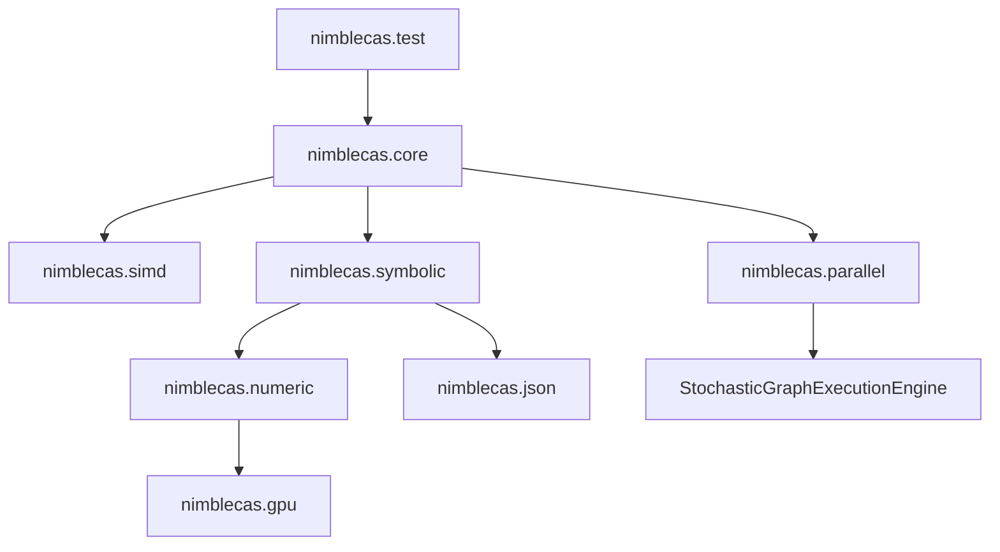

# NimbleCAS Technical Implementation Plan & Roadmap

This document defines the C++23 technical architecture, class interfaces, module structures, and implementation methodologies for **NimbleCAS**, as well as the path to scaling it across local CPUs, multiple GPUs, and distributed clusters.

---

## 1. System Architecture & C++23 Modules

NimbleCAS is designed from the ground up using **C++23 Modules** to enforce clean boundaries, maximize compilation speed, and prevent macro leakage.



### Module Declarations
- **`nimblecas.core`**: Exports basic types, constants, alignment helpers, and utility classes.
- **`nimblecas.simd`**: Dynamic SIMD vectorization engine (AVX-512, AVX2, SSE2, Scalar fallbacks).
- **`nimblecas.parallel`**: Concurrency layer wrapping Microsoft PPL on Windows and the distributed engine.
- **`nimblecas.symbolic`**: The core symbolic algebra engine based on Joel Cohen's models.
- **`nimblecas.numeric`**: Numerical solvers, matrices, and BF16/FP32 calculation routines.
- **`nimblecas.gpu`**: CUDA and accelerator offloading kernels.
- **`nimblecas.json`**: Integration with `fastestjsoninthewest` for serialization.

---

## 2. Symbolic Engine & Expression Trees (Joel S. Cohen Guide)

Expressions are represented as trees of node structures wrapped in a **Copy-on-Write (COW)** pointer to ensure thread safety and low copying cost.

### 2.1. Copy-on-Write Pointer Class (`CowPtr`)
To prevent memory leaks and minimize copy overhead, a template class `CowPtr` is defined:

```cpp
export module nimblecas.core;
import std;

export namespace nimblecas {
    template <typename T>
    class CowPtr {
    private:
        std::shared_ptr<const T> m_ptr;

    public:
        using element_type = T;

        auto write() -> T& {
            if (m_ptr.use_count() > 1) {
                m_ptr = std::make_shared<const T>(*m_ptr);
            }
            return const_cast<T&>(*m_ptr);
        }

        auto read() const -> const T& {
            return *m_ptr;
        }

        template <typename... Args>
        static auto make(Args&&... args) -> CowPtr<T> {
            CowPtr<T> ptr;
            ptr.m_ptr = std::make_shared<const T>(std::forward<Args>(args)...);
            return ptr;
        }

        auto operator->() const -> const T* { return m_ptr.get(); }
        auto operator*() const -> const T& { return *m_ptr; }
    };
}
```

### 2.2. Expression Hierarchy using `std::variant`
No inheritance hierarchy is used. Instead, a node is a type-safe union (`std::variant`) to keep structures small and cache-friendly.

```cpp
export module nimblecas.symbolic;
import std;
import nimblecas.core;

export namespace nimblecas {

    struct SymbolNode {
        std::string name;
    };

    struct ConstantNode {
        std::variant<std::int64_t, double, std::pair<std::int64_t, std::int64_t>> val; // Integer, Float, or Rational
    };

    struct AddNode;
    struct MulNode;
    struct PowerNode;
    struct FunctionNode;

    using ExprNode = std::variant<
        SymbolNode,
        ConstantNode,
        std::unique_ptr<AddNode>,
        std::unique_ptr<MulNode>,
        std::unique_ptr<PowerNode>,
        std::unique_ptr<FunctionNode>,
        std::unique_ptr<FusedOperatorNode>
    >;

    class Expr {
    private:
        CowPtr<ExprNode> m_node;

    public:
        explicit Expr(ExprNode node) : m_node(CowPtr<ExprNode>::make(std::move(node))) {}

        auto node() const -> const ExprNode& { return m_node.read(); }
        auto write_node() -> ExprNode& { return m_node.write(); }

        // Fluent API / Trailing Return Type style
        auto add(const Expr& other) const -> Expr;
        auto mul(const Expr& other) const -> Expr;
        auto pow(const Expr& other) const -> Expr;
        auto simplify() const -> Expr;
    };

    struct AddNode {
        std::vector<Expr> terms;
    };

    struct MulNode {
        std::vector<Expr> factors;
    };

    struct PowerNode {
        Expr base;
        Expr exponent;
    };

    struct FunctionNode {
        std::string name;
        std::vector<Expr> args;
    };

    struct FusedOperatorNode {
        enum class OpType { FMA }; // Fused Multiply-Add
        OpType type;
        std::vector<Expr> operands;
    };
}
```

### 2.3. Cohen Algorithmic Implementations

#### `FreeOf(u, t)`
Determines if expression $u$ does not contain sub-expression $t$.
```cpp
auto free_of(const Expr& u, const Expr& t) -> bool {
    if (u.is_equivalent_to(t)) return false;
    return std::visit([&t](const auto& node) -> bool {
        using T = std::decay_t<decltype(node)>;
        if constexpr (std::is_same_v<T, SymbolNode> || std::is_same_v<T, ConstantNode>) {
            return true;
        } else if constexpr (std::is_same_v<T, std::unique_ptr<AddNode>>) {
            return std::ranges::all_of(node->terms, [&t](const auto& term) { return free_of(term, t); });
        } else if constexpr (std::is_same_v<T, std::unique_ptr<MulNode>>) {
            return std::ranges::all_of(node->factors, [&t](const auto& factor) { return free_of(factor, t); });
        } else if constexpr (std::is_same_v<T, std::unique_ptr<PowerNode>>) {
            return free_of(node->base, t) && free_of(node->exponent, t);
        } else if constexpr (std::is_same_v<T, std::unique_ptr<FunctionNode>>) {
            return std::ranges::all_of(node->args, [&t](const auto& arg) { return free_of(arg, t); });
        }
    }, u.node());
}
```

#### `Substitute(u, t, r)`
Replaces all instances of sub-expression $t$ with $r$ in $u$.
```cpp
auto substitute(const Expr& u, const Expr& t, const Expr& r) -> Expr {
    if (u.is_equivalent_to(t)) return r;
    return std::visit([&t, &r](const auto& node) -> Expr {
        using T = std::decay_t<decltype(node)>;
        if constexpr (std::is_same_v<T, SymbolNode> || std::is_same_v<T, ConstantNode>) {
            return Expr(node);
        } else if constexpr (std::is_same_v<T, std::unique_ptr<AddNode>>) {
            std::vector<Expr> new_terms;
            for (const auto& term : node->terms) {
                new_terms.push_back(substitute(term, t, r));
            }
            return Expr(std::make_unique<AddNode>(std::move(new_terms)));
        } // Similarly for MulNode, PowerNode, and FunctionNode
    }, u.node());
}
```

#### Automatic Simplification (`simplify`)
Automatic simplification applies mathematical invariants recursively:
1. Addition identity: $u + 0 \to u$.
2. Multiplication identities: $u \cdot 1 \to u$, $u \cdot 0 \to 0$.
3. Exponentiation rules: $u^1 \to u$, $u^0 \to 1$.
4. Polynomial ordering: Sort variables lexically (e.g., $y + x \to x + y$) to achieve a canonical form.

---

## 3. Cross-Platform CPU Concurrency (PPL / TBB)

NimbleCAS implements a unified parallel abstraction layer. Concurrency maps to **Intel oneTBB** as the default parallel library on all non-Windows systems, while Windows targets leverage the Microsoft Concurrency Runtime's **Parallel Patterns Library (PPL)**.

```cpp
export module nimblecas.parallel;
import std;

#ifdef _WIN32
import <ppl.h>; // PPL for Windows
#else
import <tbb/parallel_invoke.h>; // Intel oneTBB as default
import <tbb/parallel_for.h>;
#endif

export namespace nimblecas {
    // Parallel evaluation helper
    template <typename Func>
    auto run_in_parallel(Func&& func1, Func&& func2) -> void {
        #ifdef _WIN32
        concurrency::parallel_invoke(
            std::forward<Func>(func1),
            std::forward<Func>(func2)
        );
        #else
        tbb::parallel_invoke(
            std::forward<Func>(func1),
            std::forward<Func>(func2)
        );
        #endif
    }

    // Parallel transformation mapping with support for C++20/C++23 lazy views
    template <typename R, typename MapFunc>
    requires std::ranges::random_access_range<R> && std::ranges::sized_range<R>
    auto parallel_transform(R&& range, MapFunc&& mapper) -> void {
        const size_t size = std::ranges::size(range);
        #ifdef _WIN32
        concurrency::parallel_for(size_t{0}, size, [&range, &mapper](size_t i) {
            range[i] = mapper(range[i]);
        });
        #else
        tbb::parallel_for(size_t{0}, size, [&range, &mapper](size_t i) {
            range[i] = mapper(range[i]);
        });
        #endif
    }
}
```

---

## 4. Multiregister SIMD Engine with Dynamic Dispatch

Numerical operations (such as polynomial coefficient multiplication and matrix algebra) are vectorized. At runtime, the best register paths are selected via pointer-based or conditional dynamic dispatch.

```cpp
export module nimblecas.simd;
import std;

export namespace nimblecas {
    enum class SIMDArchitecture {
        AVX512,
        AVX2,
        SSE2,
        Scalar
    };

    // Global selector determined once at process startup
    auto detect_simd_support() -> SIMDArchitecture {
        // Query CPUID
        return SIMDArchitecture::AVX2;
    }

    // Interface definition
    struct SIMDOperations {
        auto (*add_arrays)(const float* a, const float* b, float* c, std::size_t size) -> void;
    };

    // SSE2 Path
    auto add_arrays_sse2(const float* a, const float* b, float* c, std::size_t size) -> void {
        // SSE2 implementations
    }

    // AVX2 Path
    auto add_arrays_avx2(const float* a, const float* b, float* c, std::size_t size) -> void {
        // AVX2 implementations
    }

    // AVX512 Path (requires compiler attributes as per Code Policy Rule 50)
    [[gnu::target("avx512f,avx512dq,fma")]]
    auto add_arrays_avx512(const float* a, const float* b, float* c, std::size_t size) -> void {
        // AVX-512 implementation
    }

    // Scalar fallback
    auto add_arrays_scalar(const float* a, const float* b, float* c, std::size_t size) -> void {
        for (std::size_t i = 0; i < size; ++i) {
            c[i] = a[i] + b[i];
        }
    }

    // Dynamic Dispatcher class
    class SIMDDispatcher {
    public:
        SIMDOperations ops;

        explicit SIMDDispatcher() {
            auto arch = detect_simd_support();
            if (arch == SIMDArchitecture::AVX512) {
                ops.add_arrays = &add_arrays_avx512;
            } else if (arch == SIMDArchitecture::AVX2) {
                ops.add_arrays = &add_arrays_avx2;
            } else if (arch == SIMDArchitecture::SSE2) {
                ops.add_arrays = &add_arrays_sse2;
            } else {
                ops.add_arrays = &add_arrays_scalar;
            }
        }
    };
}
```

---

## 5. Parallel & GPU-Accelerated Symbolic Engine (JIT & Flat Polish Notation)

NimbleCAS implements advanced hardware acceleration to shift bottlenecks in symbolic algebra from the CPU to local GPU resources.

### 5.1. Runtime Code Generation (JIT Compilation via NVRTC)
Dynamic pointer-heavy expression trees are inefficient for the GPU due to memory access divergence. To solve this:
- **Kernel Compilation**: The CPU simplifies the symbolic tree and compiles the expression at runtime into CUDA source code using **NVIDIA Runtime Compilation (NVRTC)**.
- **Grid Evaluation**: The compiled kernel is loaded dynamically and executed on the GPU, evaluating the expression concurrently over millions of elements.

### 5.2. Flattened Polish Stacks for Symbolic Parallelism
For pure symbolic evaluations (e.g. pattern matching or subterm search) on the GPU:
- **Linearization**: Pointer-based trees are flattened into contiguous arrays using Polish prefix/postfix notation (e.g., $x^2 + 5$ becomes `[Add, Pow, Sym(x), Const(2), Const(5)]`).
- **Parallel Scanning**: Multiple GPU threads scan these contiguous stack buffers concurrently using GPU-coalesced memory accesses, eliminating tree traversal branch divergence.

### 5.3. Modular Polynomial Arithmetic on the GPU
Multivariate polynomial GCD and resultant calculations are parallelized via modular reduction:
1. **Modular Splitting**: The polynomial is split into independent images modulo several primes $p_i$.
2. **GPU Arithmetic**: GPU threads compute the GCD of the modular images in parallel. To avoid the high cost of integer division on the GPU, modular reductions utilize **Montgomery multiplication** or **Barrett reduction**.
3. **Reconstruction**: The GPU performs a parallelized **Chinese Remainder Theorem (CRT)** or **Mixed-Radix Conversion (MRC)** to reconstruct the final integer coefficients of the polynomial GCD.

### 5.4. Triton-Based Math Kernels & Multi-GPU Scale
For heavy parallelized numeric evaluations (such as simulating $10^6$ Euler-Maruyama SDE paths, calculating dense Lyapunov exponents, or executing Daubechies DWT filters):
- **Triton Python API**: Custom math kernels are written in **OpenAI's Triton** syntax. The Triton compiler automatically generates optimized LLVM IR and PTX code.
- **Triton Advantages**: Automatically handles memory coalescing, block-level execution scheduling, and shared memory management, producing kernels that rival hand-tuned CUDA.
- **Multi-GPU Parallelism**: The `nimblecas.gpu` layer launches independent Triton execution streams across multiple local GPUs concurrently, using PyTorch/CUDA multi-stream orchestration.

### 5.5. GPU Technology Stack (`nimblecas.gpu`)
The `nimblecas.gpu` module is a thin, capability-detecting layer with a **CPU fallback**: if no CUDA device is present (or the toolkit is absent), every entry point transparently runs the existing SIMD/TBB CPU path, so the engine is always usable. When a device is available it dispatches to the appropriate GPU technology:

- **CUDA (nvcc / driver API)**: hand-written kernels for the parallelizable numeric cores — modular polynomial arithmetic (Montgomery/Barrett), parallel CRT/MRC reconstruction (§5.3), flattened-Polish symbolic scans (§5.2), and Euler-Maruyama / Milstein SDE path batches (§7.8).
- **NVRTC**: runtime JIT of automatically-simplified expression trees into CUDA kernels for grid evaluation over millions of points (§5.1), avoiding pointer-chasing on the device.
- **CUDA Graphs**: capture-and-replay of repeated launch sequences — SDE time-stepping loops, Krylov/JFNK iterations, parameter sweeps — to eliminate per-launch overhead on long iterative runs.
- **cuTile**: tile-based kernels (CUDA tile programming model) for structured dense/blocked numeric work (matrix tiles, convolution/coefficient tiles) that maps cleanly to Blackwell tensor/tile hardware.
- **cuBLAS / cuBLASLt**: dense linear algebra — GEMM and the factorization building blocks behind the numeric matrix layer (Cholesky, QR, SVD, iterative solvers, §7.2).
- **Triton (Python)**: high-level custom math kernels (§5.4) — batched SDE simulation, dense Lyapunov exponents, Daubechies DWT filters — compiled to PTX, orchestrated across multiple GPUs.

**Reproducibility & precision**: GPU numeric paths follow the same BF16/FP32 policy as the CPU (NFR-1); results are validated against the CPU reference within documented tolerances, and determinism-sensitive reductions use fixed ordering.

**Toolchain**: CUDA 13.2 (nvcc + NVRTC + cuBLAS) is the reference; the CMake build adds an optional CUDA language target guarded by device/toolkit detection (like the nanobind/Python option), and Triton is provisioned into the uv environment (`torch` + `triton`).

---

## 6. Distributed Symbolic Scaling via StochasticGraphExecutionEngine

To scale computations beyond a single node, NimbleCAS distributes computation tasks using the **`StochasticGraphExecutionEngine`** (`https://github.com/oldboldpilot/StochasticGraphExecutionEngine`).

### 6.1. Computation Graph Modeling
We represent complex symbolic-numeric systems (such as high-order Homotopy Analysis Method expansions or massive ODE/SDE parameter sweeps) as a Directed Acyclic Graph (DAG) using the stochastic task graph structures:
- **Tasks**: Nodes represent tasks (e.g. computing Adomian Polynomials, solving modular polynomial images, or running SDE paths).
- **Stochastic Scheduling**: Task nodes carry execution time estimates and variance models. The scheduler dynamically balances loads across local PPL CPU threads, local GPUs, and remote cluster workers.
- **Hardware Affinities**: Nodes declare affinities: `CPU_ONLY`, `GPU_ONLY`, or `HYBRID`.

### 6.2. Distributed Modular Computations and Memoization
The distributed scheduler optimizes symbolic execution using algebraic properties:
1. **Distributed Modular GCD**: The coordinator broadcasts modular polynomial GCD images (modulo different primes $p_i$) across the cluster. Remote nodes compute modular images independently, and the coordinator merges results.
2. **Distributed Hash-Consing**: The cluster implements a distributed memoization key-value table. Simplified sub-expressions are hashed and cached across the network, preventing redundant symbolic simplifications.
3. **Data Locality Optimization**: Tasks are scheduled on nodes that already hold parent datasets (e.g. a downstream matrix calculation is scheduled on the specific GPU holding the parent matrix) to minimize inter-node TCP/IP or PCIe transfers.

---

## 7. Advanced Math & Analytical Solvers (including Esoterica)

NimbleCAS extends Joel Cohen's core symbolic algebra engine to support advanced mathematical branches and analytical approximation methods for non-linear systems.

### 7.1. Special Functions and Complex Numbers
- **Lambert W Function (`lambertW(z)`)**:
  - **Representation**: A `LambertWNode` holding a sub-expression $z$ and a branch integer $k \in \{0, -1\}$.
  - **Evaluation**: Evaluated analytically using Taylor series around $z=0$ for $|z| < \frac{1}{e}$. For complex or large values, Halley's numerical iteration method is executed in the complex plane:
    $$w_{n+1} = w_n - \frac{w_n e^{w_n} - z}{e^{w_n}(w_n + 1) - \frac{(w_n + 2)(w_n e^{w_n} - z)}{2w_n + 2}}$$
- **Complex Numbers**:
  - **Representation**: A `ComplexNode` containing real and imaginary parts ($x + i y$) represented as recursive expression sub-trees.
  - **Identities**: Automatic simplification handles branch cuts, complex conjugation ($\bar{z}$), residues, and Euler's formula conversion ($e^{i \theta} \to \cos \theta + i \sin \theta$).

### 7.2. Linear Algebra, Decompositions, and Iterative Solvers
- **Symbolic Matrices**: A `MatrixNode` containing a 2D vector of sub-expressions.
- **Cholesky Decomposition**: Computes the Cholesky factor $L$ of a symmetric positive-definite matrix $A$ ($A = L L^T$) using:
  $$L_{j,j} = \sqrt{A_{j,j} - \sum_{k=1}^{j-1} L_{j,k}^2}, \quad L_{i,j} = \frac{1}{L_{j,j}} \left( A_{i,j} - \sum_{k=1}^{j-1} L_{i,k} L_{j,k} \right) \text{ for } i > j$$
  parallelized over CPU registers (AVX-512) and GPU warps.
- **Eigenvalue Solvers**:
  - **Dense QR Algorithm**: Computes all eigenvalues via iterative QR decompositions ($A_k = Q_k R_k$, $A_{k+1} = R_k Q_k$) using Householder reflections.
  - **Lanczos Iteration**: Tridiagonalizes large symmetric matrices $A$ to extract extreme eigenvalues (Ritz values) with low memory footprint.
  - **Arnoldi Iteration**: Builds an orthonormal basis of the Krylov subspace for general non-symmetric matrices, computing upper Hessenberg matrices to solve generalized eigenvalue problems.
- **Iterative Linear Solvers**: Solves large sparse systems $A x = b$:
  - **Stationary Methods**: Jacobi, Gauss-Seidel, and Successive Over-Relaxation (SOR) with dynamic relaxation parameters $\omega$.
  - **Krylov Subspace Solvers**: Conjugate Gradient (CG) for positive-definite systems, GMRES with Gram-Schmidt orthogonalization, and BiCGSTAB for general sparse systems, utilizing block Jacobi preconditioners.

### 7.3. Series, Transforms, Wavelets, and Spectral Methods
- **Taylor, Laurent, and Puiseux Series**:
  - **Taylor's Series**: Computes univariate expansions around point $z = a$ up to order $n$:
    $$f(z) \approx \sum_{k=0}^n \frac{f^{(k)}(a)}{k!} (z-a)^k$$
    acting on both the **real** ($\mathbb{R}$) and **complex** ($\mathbb{C}$) domains. Leverages high-order symbolic differentiation or composite lookup compositions.
  - **Laurent & Puiseux Series**: Supports negative power terms (for pole singularities) and fractional power terms (for branch points). Evaluates residues at poles using $\operatorname{Res}(f, a) = a_{-1}$.
  - **Convergence Radius**: Calculates the radius of convergence $R$ using the Cauchy-Hadamard formula:
    $$R = \frac{1}{\limsup_{k\to\infty} \sqrt[k]{|a_k|}}$$
- **Series & Sequence Manipulation**:
  - **Gosper's Hypergeometric Summation**: Determines if a sum $S_n = \sum_{k=0}^{n-1} t_k$ of a hypergeometric term $t_k$ (where $t_{k+1}/t_k$ is a rational function of $k$) can be written in closed-form $S_n = z_n - z_0$ by solving the key equation for a polynomial $y(k)$:
    $$\frac{t_{k+1}}{t_k} = \frac{p(k+1)}{p(k)} \frac{q(k)}{r(k+1)}$$
  - **Series Reversion & Cauchy Products**: Composes series coefficients via Lagrange Inversion (reversing $w = f(z)$ to find $z = f^{-1}(w)$) and evaluates products $A(z)B(z) = \sum_n (\sum_{k=0}^n a_k b_{n-k}) z^n$ optimized using parallel zero-copy views.
- **Wavelets**: Modules for Continuous Wavelet Transform (CWT) and Discrete Wavelet Transform (DWT), containing precompiled filters (Haar, Daubechies 4/8, Morlet) optimized via SIMD vector registers.
- **Spectral and Pseudo-Spectral Methods**: Solves differential equations numerically by representing the solution $u(x)$ as a sum of global basis functions:
  - **Fourier Collocation & Pseudo-Spectral Derivatives**: Evaluates derivatives in frequency space using the FFT ($\widehat{u'} = i k \widehat{u}$), while evaluating non-linear products directly on the physical grid to bypass convolution calculations.
  - **Orszag 2/3-rule Dealiasing**: To eliminate quadratic aliasing errors from grid-domain products, the engine zeros out the upper third of the computed Fourier spectrum ($|k| \ge \frac{2}{3} \frac{N}{2}$) at each time step.
  - **Chebyshev Collocation**: Used for non-periodic boundaries, mapping grid points to Chebyshev-Gauss-Lobatto nodes $x_j = \cos(\pi j / N)$ and computing spatial derivatives via Chebyshev differentiation matrices.

### 7.4. Singular Perturbation of ODEs
- **Matched Asymptotic Expansions**: Solves boundary layer problems of the form $\epsilon y'' + p(x)y' + q(x)y = 0$.
- **Implementation**:
  1. Identifies singular perturbation terms by searching for parameter symbol $\epsilon$ multiplying high-order derivatives.
  2. Solves the **Outer Expansion** by setting $\epsilon = 0$.
  3. Solves the **Inner Expansion** in the boundary layer by introducing the stretched coordinate $\tilde{x} = \frac{x-a}{\epsilon^\alpha}$.
  4. Automatically matches coefficients using Prandtl's matching condition.

### 7.5. Homotopy Methods (HAM, ADM, HPM, HAP)
For highly non-linear differential equations where classical perturbation methods fail, NimbleCAS implements symbolic solvers using homotopy expansions.

#### 1. Homotopy Analysis Method (HAM)
- Constructs a continuous mapping from an initial guess $u_0(t)$ to the exact solution $u(t)$.
- **Deformation Equation**:
  $$(1-p)\mathcal{L}[\phi(t;p) - u_0(t)] = p h \mathcal{H}(t) \mathcal{N}[\phi(t;p)]$$
  where $p \in [0, 1]$ is the embedding parameter, $h$ is the auxiliary parameter (used to plot the $h$-curves to determine convergence), $\mathcal{L}$ is the auxiliary linear operator, and $\mathcal{N}$ is the non-linear operator.
- **Solver**: Symbolically differentiates the deformation equation $m$ times with respect to $p$, divides by $m!$, sets $p=0$, and solves the resulting linear equations recursively.

#### 2. Adomian Decomposition Method (ADM)
- Decomposes the solution as $u = \sum_{n=0}^{\infty} u_n$ and the non-linear term $N(u) = \sum_{n=0}^{\infty} A_n$ where $A_n$ are the **Adomian Polynomials**.
- **Polynomial Generation**:
  $$A_n = \frac{1}{n!} \left[ \frac{d^n}{dp^n} N\left( \sum_{i=0}^{\infty} p^i u_i \right) \right]_{p=0}$$
- **Solver**: NimbleCAS recursively computes $A_n$ symbolically using higher-order symbolic differentiation and solves:
  $$u_{n+1} = L^{-1}(A_n)$$
  where $L^{-1}$ is the integral operator.

#### 3. Homotopy Perturbation Method (HPM) and Homotopy Analysis Protocol (HAP)
- Combines perturbation theory with homotopy, constructing:
  $$H(u, p) = (1-p)[L(u) - L(u_0)] + p[A(u) - f(r)] = 0$$
- Solves the sequence of linear problems for each coefficient of $p^k$, executing the **Homotopy Analysis Protocol (HAP)** to verify the boundaries of convergence.

#### 4. Padé Approximations
- Computes rational approximations $[M/N](x)$ of a symbolic function around $x=0$ by extracting its Taylor expansion $f(x) = \sum_{k=0}^{M+N} c_k x^k$.
- Solves the Hankel matrix system of linear equations for denominator coefficients $q_i$ and computes numerator coefficients $p_j$ using:
  $$\sum_{j=0}^{k} c_{k-j} q_j = p_k \quad (\text{with } q_0=1, q_i=0 \text{ for } i > N, p_j=0 \text{ for } j > M)$$
  utilizing dynamic SIMD execution for numeric coefficients.

#### 5. Continued Fractions
- Implementation of **Viskovatov's algorithm** to convert power series directly into continued fraction representations:
  $$f(x) \approx b_0 + \frac{a_1 x}{b_1 + \frac{a_2 x}{b_2 + \frac{a_3 x}{\dots}}}$$
- Evaluates the $n$-th convergent $A_n/B_n$ using the forward recurrence relation:
  $$A_n = b_n A_{n-1} + a_n x A_{n-2}, \quad B_n = b_n B_{n-1} + a_n x B_{n-2}$$
  to enable highly stable and fast numerical evaluation of special transcendental functions on the CPU and GPU.

### 7.6. Laplace Methods and Integral Transforms
- **Laplace Transforms**: Table-driven and rule-based forward and inverse Laplace transform algorithms, handling convolution theorem, delta functions, and step functions.
- **Laplace's Approximation Method**: Integrals of the form $I(M) = \int_a^b e^{M f(x)} g(x) dx$ are approximated asymptotically for large $M$ using:
  $$I(M) \approx \sqrt{\frac{2\pi}{M |f''(x_0)|}} e^{M f(x_0)} g(x_0)$$
  where $x_0 \in (a, b)$ is the unique point where $f(x)$ attains its maximum.

### 7.7. Probability and Generating Functions
- **Generating Functions**: Algebraic solvers to convert linear recurrence equations to generating functions $G(x) = \sum a_n x^n$. Computes Taylor series coefficients of rational/transcendental generating functions to find closed-form recurrence sequences.
- **Probability distributions**: Symbolic representation of continuous/discrete PDFs. Computes expected values and variances using symbolic integration:
  $$\mathbb{E}[X] = \int_{-\infty}^{\infty} x \cdot f(x) dx$$

### 7.8. Stochastic Differential Equations (SDEs and SPDEs)
- **Itô Calculus**: Multidimensional Itô lemma implementation:
  $$d f(t, X_t) = \left( \frac{\partial f}{\partial t} + \mu_t \frac{\partial f}{\partial x} + \frac{1}{2} \sigma_t^2 \frac{\partial^2 f}{\partial x^2} \right) dt + \sigma_t \frac{\partial f}{\partial x} d W_t$$
- **Euler-Maruyama & Milstein Simulation**: Numeric loops parallelized via PPL and compiled to GPU kernels for high-speed paths simulation of multi-asset SDEs.

### 7.9. Difference Equations and Recurrence Relations
- **Difference Equation Solvers**: Solver classes for $a_n y_{n+k} + \dots + a_0 y_n = f(n)$ using characteristic polynomials and Z-transforms.

### 7.10. Dynamical Systems, Chaos, and Stability
- **Fixed Points and Stability**: Evaluates steady states of non-linear vector fields $\dot{x} = f(x)$, constructs the symbolic Jacobian matrix $J$, computes eigenvalues at fixed points to determine local stability (sink, source, saddle, spiral), and solves bifurcation equations.
- **Chaos Numerics**: Optimized double-precision ODE integration solvers running parallelized on CPU and GPU to compute Lyapunov exponents and Poincaré sections.

### 7.11. Plotting and Visualization
- **Adaptive Grid Generation**: Implements adaptive mesh refinement (AMR) algorithms to automatically detect high-curvature regions and increase sample density (preventing jagged edges in steep slope functions).
- **DirectX/Vulkan Native Renderer**: High-performance native Windows rendering using vertex buffers generated directly on the GPU (e.g. from Triton SDE paths or matrix coordinate arrays), bypassing CPU read-back.
- **Interactive JSON Data Serialization**: For web environments (Jupyter/Python bindings), the plotting module formats data into highly optimized JSON structures parsed by frontend visualization libraries (e.g., WebGPU/WebGL-based Three.js or custom shaders).
- **Parameter Sweep Bindings**: Interacts with the `nimblecas.parallel` PPL task scheduler to recalculate surface mesh points on-the-fly as user-adjusted slider parameters vary.

### 7.12. LaTeX Math Exporter
- **AST to LaTeX Formatting**: Walks the symbolic AST recursively and translates math operations into valid LaTeX tags.
  - Division node `Div(A, B)` formats to `\frac{A}{B}`.
  - Integration node `Integral(f, x, a, b)` formats to `\int_{a}^{b} f(x) \, dx`.
  - Special functions like `lambertW(z)` translate to `\text{W}(z)`.
  - Matrix containers map to `\begin{pmatrix} ... \end{pmatrix}` with rows separated by `\\`.
- **Monadic and Fluent Integration**: Exposes `.to_latex()` on the Expression class to enable fluent format conversions.

### 7.13. Executable Document Engine
- **Markdown Parsing & AST Construction**: A custom parser extracts text and code block elements into a unified Document AST. Code fence languages trigger dedicated execution dispatchers.
- **Incremental Cell Execution**: Each code cell is hashed based on its text and any previous variables/expressions it references. The executor manages an in-memory session state, skipping execution of unchanged cells by pulling cached values/renders.
- **HTML, WebGL & WebGPU Generation**: Compiles executable markdown into interactive HTML pages. Math blocks are rendered using MathJax/KaTeX. If a GPU is available on the client device, 3D surface plots use embedded WebGPU or WebGL components (e.g., via Orillusion or Three.js WebGL/WebGPURenderer) for hardware-accelerated 60 FPS graphics, automatically falling back to 2D SVG/PNG layouts if no GPU is detected.

### 7.14. Numerical Solvers and Optimization Engine
- **Newton-Raphson & Multi-dimensional Systems**: Resolves $F(x) = 0$ for vector fields using symbolic Jacobian matrices generated at runtime:
  $$x_{n+1} = x_n - J(x_n)^{-1} F(x_n)$$
  using multi-threaded LU decompositions from Section 2.7.
- **Inexact Newton & JFNK (C.T. Kelley)**: Solves the linear Newton step $J(x_k) s_k = -F(x_k)$ inexactly using iterative Krylov solvers (GMRES / BiCGSTAB) to satisfy:
  $$\| F(x_k) + J(x_k) s_k \| \le \eta_k \| F(x_k) \|$$
  where $\eta_k$ is the forcing term computed using Kelley's choice: $\eta_k = \gamma (\|F(x_k)\|/\|F(x_{k-1})\|)^\alpha$ to prevent oversolving.
  - **Jacobian-Free Newton-Krylov (JFNK)**: Evaluates Jacobian-vector products $J(x)v$ without forming or storing the Jacobian matrix, using finite difference approximations:
    $$J(x) v \approx \frac{F(x + \epsilon v) - F(x)}{\epsilon}$$
    leveraging the parallelized GMRES solver.
- **Armijo Line Search**: Ensures global convergence of Newton steps by performing backtracking line search to find step size $\lambda$ satisfying the Armijo condition:
  $$\| F(x_k + \lambda s_k) \| < (1 - \alpha \lambda) \| F(x_k) \|$$
- **Anderson Acceleration**: Accelerates fixed-point iterations $x_{k+1} = g(x_k)$ by forming the new estimate as a linear combination of the past $m$ iterations:
  $$x_{k+1} = \sum_{i=0}^m \alpha_i g(x_{k-m+i})$$
  solving a small optimization problem for $\alpha_i$ to minimize the residual norm.
- **Broyden's Quasi-Newton Method**: Updates the Jacobian approximation $B_n$ using the rank-one update formula:
  $$B_{n+1} = B_n + \frac{\Delta F_n - B_n \Delta x_n}{\|\Delta x_n\|^2} \Delta x_n^T$$
  to avoid costly symbolic evaluations of $J(x_n)$ at every iteration.
- **L-BFGS Optimization**: Implements the limited-memory Broyden-Fletcher-Goldfarb-Shanno algorithm for high-dimensional non-linear minimizations, utilizing past iteration history vectors ($s_k, y_k$) to approximate the inverse Hessian.
- **Levenberg-Marquardt Solver**: Solves non-linear least squares curve fitting $\min \sum [r_i(\beta)]^2$ by interpolating between Gauss-Newton and gradient descent:
  $$(J^T J + \lambda \operatorname{diag}(J^T J)) \delta = J^T r$$
  implemented as parallelized loops on the GPU using Triton.
- **Cubic Splines and B-Splines Solver**: Constructs piecewise-polynomial curves passing through a set of knots $x_0, x_1, \dots, x_k$.
  - For cubic splines: Solves a tridiagonal system of continuity equations for second-derivatives $S''_i(x)$ at each knot using the iterative thomas-algorithm, enforcing boundary conditions (natural, clamped, or periodic).
  - For B-splines and NURBS: Evaluates basis functions $N_{i,p}(u)$ recursively via the **Cox-de Boor recursion formula**:
    $$N_{i,0}(u) = \begin{cases} 1 & \text{if } u_i \le u < u_{i+1} \\ 0 & \text{otherwise} \end{cases}$$
    $$N_{i,p}(u) = \frac{u - u_i}{u_{i+p} - u_i} N_{i,p-1}(u) + \frac{u_{i+p+1} - u}{u_{i+p+1} - u_{i+1}} N_{i+1,p-1}(u)$$
    mapping rational curves with weight variables $w_i$.

### 7.15. Quantum Mechanics and Functional Analysis Engine
- **Non-Commutative Algebraic Simplifiers**: The simplification engine parses operator variables as non-commutative symbols. Lie brackets $[A, B]$ are represented using a `LieBracketNode` with algebraic reduction rules:
  - Linearity: $[\alpha A + \beta B, C] = \alpha [A, C] + \beta [B, C]$
  - Jacobi Identity expansions.
- **Dirac Notation Objects**:
  - `KetNode` and `BraNode` containing state identification tags (e.g. $|\psi\rangle$, $\langle\phi|$).
  - Conjugation and Dagger operations maps $A^\dagger$ and conjugates state vectors.
  - Operator application evaluates $\hat{O} |\psi\rangle$ by checking defined projection mappings, matrix representations, or eigenvalue coefficients.
- **Abstract Function Spaces, Norms & Metrics**:
  - `HilbertSpace` structures specifying domain boundaries, inner-product rules (e.g., $L^2$ integration formulas $\langle f, g \rangle = \int_a^b f(x) \overline{g(x)} dx$), inducing the norm $\|f\| = \sqrt{\langle f, f \rangle}$ and inducing the metric $d(f, g) = \|f - g\|$, along with projection mappings.
  - `NormNode` and `MetricNode` tracking abstract normed operations $\|x\|_p$ for Banach spaces and distance metrics $d(x, y)$ for metric spaces, applying algebraic reductions and inequalities (e.g., positive definiteness, triangle inequalities $\|x + y\| \le \|x\| + \|y\|$ and $d(x, z) \le d(x, y) + d(y, z)$).

### 7.16. Classical Orthogonal Polynomials
- **Orthogonal Polynomial Nodes**: Dedicated classes `ChebyshevTNode`, `ChebyshevUNode`, `LegendrePNode`, `LaguerreLNode`, `HermiteHNode`, and `JacobiPNode` that store degree $n$ and symbol $x$.
- **Symbolic Expansion Engines**: Evaluates polynomials symbolically to ordinary polynomial forms using three-term recurrences, preventing factorial calculation overflow:
  - Chebyshev: $T_{n+1}(x) = 2x T_n(x) - T_{n-1}(x)$ with $T_0(x) = 1, T_1(x) = x$.
  - Legendre: $(n+1) P_{n+1}(x) = (2n+1) x P_n(x) - n P_{n-1}(x)$ with $P_0(x) = 1, P_1(x) = x$.
  - Laguerre: $(n+1) L_{n+1}(x) = (2n+1-x) L_n(x) - n L_{n-1}(x)$ with $L_0(x) = 1, L_1(x) = 1-x$.
  - Hermite (Physicist): $H_{n+1}(x) = 2x H_n(x) - 2n H_{n-1}(x)$ with $H_0(x) = 1, H_1(x) = 2x$.
  - Jacobi: Recurrence coefficients derived dynamically using $\alpha, \beta$ parameter expressions.
- **Rodrigues' Formula Integrator**: Computes analytical derivatives to verify polynomials:
  $$P_n(x) = \frac{1}{2^n n!} \frac{d^n}{dx^n} (x^2 - 1)^n$$
  leveraging the recursive differentiation engine from Cohen's guide.

### 7.17. Polynomial and Rational Arithmetic (including Partial Fraction Decomposition)
- **Multivariate Polynomial GCD**: Computes greatest common divisors in $\mathbb{Z}[x_1, \dots, x_k]$ using subresultant Polynomial Remainder Sequences (PRS) to control coefficient growth.
- **Yun's Square-Free Factorization**: Decomposes polynomials into square-free components:
  $$u(x) = \prod_{i=1}^m a_i(x)^i$$
  where each $a_i(x)$ is square-free and $\gcd(a_i, a_j) = 1$ for $i \ne j$.
- **Partial Fraction Decomposition (PFD)**: Evaluates the PFD of a rational function $A(x)/B(x)$.
  1. Computes the square-free factorization of the denominator $B(x) = \prod_{i=1}^m b_i(x)^i$.
  2. Applies **Hermite reduction** or undetermined coefficients to decompose $A(x)/B(x)$ into simpler rational terms:
     $$\frac{A(x)}{B(x)} = P(x) + \sum_{i} \sum_{j=1}^{d_i} \frac{C_{i,j}(x)}{b_i(x)^j}$$
     with $\deg(C_{i,j}) < \deg(b_i)$.

### 7.18. Combinatorics and Integer Sequences
Combinatorial functions grow super-exponentially, so evaluation avoids the naive factorial route entirely and relies on recurrences, table generation, and arbitrary-precision integers. All sequences are exposed both as *symbolic AST nodes* (kept unevaluated inside larger expressions, e.g. $\binom{n}{k} x^k$) and as *closed evaluators* returning exact `BigInt` values.

#### AST Representation
Combinatorial terms extend the `FunctionNode` family with a dedicated tagged node so that automatic simplification can apply identities before any numeric expansion is forced.
```cpp
export module nimblecas.symbolic;
import std;

export namespace nimblecas {

    // Arbitrary-precision signed integer (limb vector) — combinatorial values
    // routinely exceed 64 bits (e.g. 50! ≈ 3.0e64), so std::int64_t is unsafe.
    class BigInt;

    struct CombinatoricNode {
        enum class Kind : std::uint8_t {
            Binomial,        // C(n, k)
            Factorial,       // n!
            Subfactorial,    // !n  (derangements)
            Multinomial,     // multinomial(n; k1, k2, ...)
            StirlingFirst,   // [n, k]  (unsigned, cycle count)
            StirlingSecond,  // {n, k}  (set partitions)
            Bell,            // B_n
            Catalan,         // C_n
            Bernoulli,       // B_n  (rational)
            Euler,           // E_n
            Eulerian,        // <n, k>
            Partition,       // p(n)
            Fibonacci,       // F_n
            Lucas,           // L_n
            Harmonic,        // H_n or H_{n,r}
            FallingFactorial,// x^{\underline{n}}
            RisingFactorial, // x^{\overline{n}}  (Pochhammer)
            Pochhammer       // (x)_n
        };
        Kind kind;
        std::vector<Expr> params;   // e.g. {n, k}; args carry symbolic sub-trees
    };
}
```
The variant `ExprNode` gains `std::unique_ptr<CombinatoricNode>`, and `free_of`/`substitute`/`differentiate` are extended with `constexpr if` arms that recurse into `params` exactly like `FunctionNode`.

#### Recurrence-Based Evaluation (no factorial overflow)
Following the guidance of *Concrete Mathematics* (Graham, Knuth, Patashnik), each closed evaluator uses the numerically stable recurrence rather than ratios of factorials:
- **Binomial**: multiplicative form $\binom{n}{k} = \prod_{i=1}^{k} \frac{n-i+1}{i}$, taking $k \leftarrow \min(k, n-k)$ first; every partial product is an exact integer, so no rational reduction is needed.
- **Stirling (first / second kind)**: computed by dynamic-programming triangles built row-by-row into an aligned `std::vector<BigInt>`:
  $$\left[ {n \atop k} \right] = \left[ {n-1 \atop k-1} \right] + (n-1)\left[ {n-1 \atop k} \right], \qquad \left\{ {n \atop k} \right\} = \left\{ {n-1 \atop k-1} \right\} + k\left\{ {n-1 \atop k} \right\}$$
- **Bell numbers**: generated via the **Bell triangle** (Aitken's array), where each row's first entry is the previous row's last, and $B_n$ is the leading entry of row $n$; equivalently $B_{n+1} = \sum_{k=0}^{n} \binom{n}{k} B_k$.
- **Catalan**: the integer recurrence $C_{n+1} = \frac{2(2n+1)}{n+2} C_n$ with $C_0 = 1$, which stays exact because the ratio is always integral.
- **Bernoulli numbers** (rational): computed with the Akiyama–Tanigawa algorithm over exact `Rational` values, avoiding the cancellation of the zeta-based formula; $B_n$ feeds Euler–Maclaurin summation and Faulhaber's formula for $\sum k^m$.
- **Euler numbers / Eulerian numbers**: the boustrophedon (zig-zag) transform for $E_n$, and $\left\langle {n \atop k} \right\rangle = (k+1)\left\langle {n-1 \atop k} \right\rangle + (n-k)\left\langle {n-1 \atop k-1} \right\rangle$ for Eulerian numbers.
- **Integer partitions** $p(n)$: Euler's **pentagonal number theorem** recurrence
  $$p(n) = \sum_{k \ge 1} (-1)^{k-1}\left[ p\!\left(n - \tfrac{k(3k-1)}{2}\right) + p\!\left(n - \tfrac{k(3k+1)}{2}\right) \right]$$
  filled bottom-up into a memo table — $O(n^{3/2})$ terms rather than the exponential enumeration.
- **Fibonacci / Lucas**: the **fast-doubling** identities give $O(\log n)$ evaluation without a lookup table:
  $$F_{2k} = F_k\,(2F_{k+1} - F_k), \qquad F_{2k+1} = F_{k+1}^2 + F_k^2, \qquad L_n = 2F_{n+1} - F_n.$$
- **Falling / rising factorials & Pochhammer**: expanded symbolically as products $x^{\underline{n}} = \prod_{k=0}^{n-1}(x-k)$ and $(x)_n = \prod_{k=0}^{n-1}(x+k)$, with conversions to/from ordinary powers using the Stirling-number transforms $x^{\underline{n}} = \sum_k s(n,k)\, x^k$ and $x^n = \sum_k \left\{ {n \atop k} \right\} x^{\underline{k}}$.
- **Harmonic numbers**: generalized $H_{n,r} = \sum_{i=1}^{n} i^{-r}$ accumulated as an exact `Rational` (common-denominator reduction via `BigInt` GCD), with an FP32/BF16 fast path for large $n$ where only a numeric value is required.

#### Automatic Simplification Identities
Before forcing evaluation, the simplifier rewrites combinatorial expressions using closed identities, which both shrinks the tree and preserves exactness for symbolic $n$:
- Pascal's rule $\binom{n}{k} = \binom{n-1}{k-1} + \binom{n-1}{k}$ and symmetry $\binom{n}{k} \to \binom{n}{n-k}$ (canonicalize to the smaller $k$).
- Absorption $k\binom{n}{k} = n\binom{n-1}{k-1}$ and the hockey-stick identity for sums of binomials.
- Boundary reductions: $\binom{n}{0} \to 1$, $\binom{n}{n} \to 1$, $n! \to n\cdot(n-1)!$ only when it enables further cancellation (guarded to avoid runaway expansion), $!0 \to 1$, $C_0 \to 1$.
- Vandermonde's convolution $\sum_k \binom{m}{k}\binom{n}{p-k} \to \binom{m+n}{p}$ recognized during sum simplification.

#### Performance & Parallelism
- **Aligned `BigInt` limbs**: limb vectors use the project's aligned allocator (Code Policy Rule 5/42); multi-limb add/multiply hot loops are dispatched through the `nimblecas.simd` waterfall (AVX-512 → AVX2 → SSE2 → scalar) for schoolbook and Karatsuba multiplication.
- **Membership fast path**: the parser's Binary Fuse Filter (§9) recognizes reserved combinatorial function names (`binomial`, `stirling1`, `catalan`, …) before any map lookup.
- **Parallel table fills**: Stirling/Eulerian triangles and partition tables are filled with `nimblecas.parallel` (`parallel_for` over independent anti-diagonals), and large batched evaluations (e.g. an entire row of $\binom{n}{k}$ for GPU polynomial coefficient generation) are offloaded through the modular-arithmetic GPU path (§5.3), reconstructing exact coefficients via CRT.

#### Fluent API
```cpp
auto probability = Combinatorics::binomial(52, 5)      // C(52,5) = 2,598,960
                       .as_rational()
                       .reciprocal()
                       .to_double();

auto expansion = Expr::symbol("x")
                     .falling_factorial(4)              // x·(x-1)·(x-2)·(x-3)
                     .expand()                          // to ordinary powers via Stirling s(4,k)
                     .to_latex();

auto bell = Combinatorics::bell(20).to_string();        // exact BigInt
```

### 7.19. Symbolic Differentiation and Integration
The recursive differentiation engine underpins nearly every other analytical module (Taylor/Laurent series §7.3, HAM/ADM §7.5, Jacobians §7.10/§7.14, Rodrigues' formulas §7.16). It is specified here as a first-class, cache-backed operator rather than being re-derived ad hoc per feature.

#### Differentiation Operator (`Derivative`)
Differentiation is a pure structural recursion over `ExprNode`, dispatched with `std::visit` and `constexpr if` in the same style as `free_of`/`substitute`. Results feed straight back into automatic simplification so derivatives return in canonical form.
```cpp
auto differentiate(const Expr& u, std::string_view x) -> Expr {
    return std::visit([&](const auto& node) -> Expr {
        using T = std::decay_t<decltype(node)>;
        if constexpr (std::is_same_v<T, ConstantNode>) {
            return Expr::integer(0);                                  // d/dx c = 0
        } else if constexpr (std::is_same_v<T, SymbolNode>) {
            return Expr::integer(node.name == x ? 1 : 0);             // d/dx x = 1, else 0
        } else if constexpr (std::is_same_v<T, std::unique_ptr<AddNode>>) {
            // Sum rule: differentiate termwise (parallelizable over terms)
            auto terms = node->terms
                       | std::views::transform([&](const Expr& t) { return differentiate(t, x); });
            return Expr::sum(std::ranges::to<std::vector>(terms));
        } else if constexpr (std::is_same_v<T, std::unique_ptr<MulNode>>) {
            return differentiate_product(*node, x);                  // Leibniz product rule
        } else if constexpr (std::is_same_v<T, std::unique_ptr<PowerNode>>) {
            return differentiate_power(*node, x);                    // general power/exponent rule
        } else if constexpr (std::is_same_v<T, std::unique_ptr<FunctionNode>>) {
            return differentiate_function(*node, x);                 // chain rule via derivative table
        }
    }, u.node());
}
```
Rules implemented:
- **Sum**: $\frac{d}{dx}\sum u_i = \sum \frac{d}{dx} u_i$ (termwise, dispatched through `parallel_transform` for wide sums).
- **Product (Leibniz)**: $\frac{d}{dx}\prod u_i = \sum_i \left(\frac{d u_i}{dx}\prod_{j\ne i} u_j\right)$.
- **Quotient**: derived from product + power rules ($u/v = u\,v^{-1}$), so no special-casing is needed.
- **General power**: for $u = f^g$, $\frac{d}{dx} f^g = f^g\left(g'\ln f + \dfrac{g f'}{f}\right)$, collapsing to $g f^{g-1} f'$ when $g$ is `FreeOf` $x$ and to $f^g (\ln f) g'$ when $f$ is constant.
- **Chain rule**: `FunctionNode` derivatives look up the outer derivative in a Binary-Fuse-guarded (§9) **derivative table** ($\sin\to\cos$, $\cos\to-\sin$, $\ln\to 1/u$, $e^u\to e^u$, $\text{erf}\to\frac{2}{\sqrt\pi}e^{-u^2}$, $\text{lambertW}\to\frac{W(u)}{u(1+W(u))}$, …) and multiply by $u'$.
- **Higher-order & partials**: `.differentiate(x, n)` iterates $n$ times with simplification between passes; multivariate gradients/Hessians differentiate against each symbol, reusing memoized sub-derivatives.

#### Unevaluated Derivatives & Hash-Consing
A `DerivativeNode { Expr operand; std::string var; std::uint32_t order; }` keeps derivatives of unknown/opaque functions symbolic (e.g. $\frac{d}{dx}f(x)$ where $f$ is user-defined). Every computed derivative is keyed in the global hash-consing table (§6.2) so repeated $\partial^2/\partial x\,\partial y$ requests in Jacobian/Hessian assembly are served from cache rather than recomputed — critical for the JFNK and HAM solvers that differentiate the same operand many times.

#### Symbolic Integration ($\int u\,dx$)
Integration follows the standard decomposition into rational and transcendental parts:
1. **Rational functions** $\int \frac{A(x)}{B(x)}\,dx$:
   - **Hermite reduction** computes the *rational part* of the integral without factoring $B$, using the square-free factorization $B = \prod b_i^i$ (§7.17) and solving the Bézout identity $s b_i + t b_i' = 1$ to reduce each multiple pole by one order:
     $$\int \frac{A}{B}\,dx = \frac{C}{D} + \int \frac{A^\ast}{B^\ast}\,dx, \qquad B^\ast \text{ square-free}.$$
   - **Rothstein–Trager** then computes the *logarithmic part* of the remaining square-free integral via the resultant
     $$R(t) = \operatorname{res}_x\!\big(A^\ast - t\,{B^\ast}'\,,\; B^\ast\big),$$
     whose distinct roots $t_k$ give $\int \frac{A^\ast}{B^\ast}\,dx = \sum_k t_k \ln\!\big(\gcd(A^\ast - t_k {B^\ast}', B^\ast)\big)$ — resultant and GCD reuse the subresultant PRS machinery from §7.17.
2. **Transcendental integrands**: a **table-driven + heuristic** layer applies, in order:
   - Pattern-matched table lookup (guarded by the Binary Fuse filter) for standard forms ($\int \sin, \int e^{ax}, \int \frac{1}{a^2+x^2}$, …).
   - **Linear substitution** detection ($u = ax+b$) and derivative-in-integrand recognition ($\int f'(g)g'\,dx$).
   - **Integration by parts** with the LIATE heuristic, bounded by a recursion/`order` budget and returned as an `std::expected<Expr, MathError>` so non-elementary integrands fail gracefully (`MathError::UndefinedValue`) rather than looping — a lightweight step toward the full Risch algorithm, which is deferred but whose square-free/resultant substrate is already in place.
3. **Definite integrals**: $\int_a^b u\,dx$ evaluates the antiderivative at the bounds via `substitute` (with limit handling for improper bounds), falling back to the numeric quadrature path (adaptive Gauss–Kronrod, SIMD-vectorized) when no closed form exists.

#### Fluent API
```cpp
auto dydx = Expr::parse("sin(x^2) + x*ln(x)")
                .differentiate("x")          // 2x·cos(x^2) + ln(x) + 1
                .simplify();

auto F = Expr::parse("(2*x + 1)/(x^2 + x)")
             .integrate("x")                 // Hermite + Rothstein–Trager → ln(x^2 + x)
             .to_latex();

auto area = Expr::parse("x^2")
                .integrate("x", 0, 1)        // definite: 1/3
                .to_double();
```

#### Planned Extensions: Differentiation Under the Integral Sign & Integral Recurrences
Beyond the pointwise differentiation/integration above, the engine will support:
- **Leibniz integral rule (differentiation under the integral sign)**: for
  $I(t) = \int_{a(t)}^{b(t)} f(x, t)\,dx$,
  $$\frac{d}{dt} I(t) = f\!\big(b(t), t\big)\,b'(t) - f\!\big(a(t), t\big)\,a'(t) + \int_{a(t)}^{b(t)} \frac{\partial f}{\partial t}(x, t)\,dx,$$
  including the parameter-differentiation ("Feynman") technique for evaluating otherwise-intractable definite integrals by introducing an auxiliary parameter, differentiating under the sign, solving the simpler integral/ODE, and integrating back in the parameter.
- **Integral recurrences (reduction formulae)**: derive and apply recurrence relations that reduce an integral's order/degree to a base case — e.g. $I_n = \int \sin^n x\,dx = -\frac{\sin^{n-1}x\cos x}{n} + \frac{n-1}{n} I_{n-2}$, and analogous reductions for $\int x^n e^{x}\,dx$, $\int \sec^n x\,dx$, and $\int x^n (\ln x)^m\,dx$ — represented symbolically (with the recurrence carried as a difference equation, §7.9) and unrolled to the base case for concrete $n$.

### 7.20. Polynomial Expansion and Division
Expansion and division are the algebraic substrate the higher polynomial features assume already exists: the GCD / square-free / PFD routines (§7.17) and the Hermite reduction in the integration engine (§7.19) all call polynomial division and degree/coefficient extraction. This section specifies them explicitly.

#### Structural vs. Dense Representations
Two views of a polynomial coexist and convert lazily:
- **Structural form**: the ordinary `ExprNode` tree (sums of `MulNode`/`PowerNode` monomials), which is what the user manipulates and what `simplify` canonicalizes.
- **Dense/recursive form** (`Polynomial`): a `std::vector<Coefficient>` of coefficients indexed by degree in a chosen *main variable*, with each coefficient itself either a `BigInt`/`Rational` (univariate) or a nested `Polynomial` in the remaining variables (multivariate, recursive representation). Coefficient vectors use the aligned allocator so the coefficient-wise add/scale hot loops run through the `nimblecas.simd` waterfall (§4).

Conversion (`Expr::as_polynomial(main_var)`) is a memoized, hash-consed projection so repeated division/GCD calls on the same operand don't re-parse the tree.

#### Expansion (`Expand(u)`)
`expand()` recursively applies the distributive law to eliminate products-of-sums and powers-of-sums, producing a canonical flattened sum of monomials:
- **Products**: $\left(\sum_i a_i\right)\left(\sum_j b_j\right) \to \sum_{i,j} a_i b_j$, evaluated as a Cauchy-style convolution when both operands are dense (dispatched to the SIMD/GPU coefficient-multiply path for high degree, Karatsuba above a tuned crossover).
- **Powers of sums** use the **multinomial theorem**, drawing coefficients directly from the combinatorics engine (§7.18):
  $$\left(\sum_{i=1}^{m} x_i\right)^{n} = \sum_{k_1+\dots+k_m=n} \binom{n}{k_1, k_2, \dots, k_m}\prod_{i=1}^{m} x_i^{k_i}.$$
- **Nested expansion** recurses into sub-expressions first (`expand` is idempotent and bottom-up), and the result is re-canonicalized by automatic simplification so like monomials merge and terms sort into the standard monomial order.

#### Division With Remainder
For $A, B \in \mathbb{F}[x]$ over a field ($\mathbb{Q}$, or $\mathbb{Z}_p$ for the modular GPU path §5.3), recursive polynomial long division produces the unique quotient and remainder with $A = B\,Q + R$ and $\deg R < \deg B$:
```cpp
auto divide(const Polynomial& a, const Polynomial& b, std::string_view x)
    -> Result<std::pair<Polynomial, Polynomial>>            // {quotient, remainder}
{
    if (b.is_zero()) { return std::unexpected(MathError::DivisionByZero); }
    auto q = Polynomial::zero();
    auto r = a;                                             // remainder starts as dividend
    const auto lc_b = b.leading_coefficient();
    while (!r.is_zero() && r.degree(x) >= b.degree(x)) {
        // leading term of the partial quotient
        auto t = r.leading_coefficient().divide(lc_b)
                  .shift(r.degree(x) - b.degree(x), x);     // (lc_r / lc_b) · x^(deg r - deg b)
        q = q.add(t);
        r = r.subtract(b.multiply(t));                      // cancel the leading term
    }
    return std::pair{ std::move(q), std::move(r) };
}
```
`quotient()`, `remainder()`, and `divides()` are thin fluent wrappers over this.

#### Pseudo-Division over ℤ[x]
To stay inside $\mathbb{Z}[x]$ and avoid rational coefficient blow-up (essential for the subresultant PRS that §7.17's multivariate GCD relies on), the engine also provides **pseudo-division**, scaling the dividend by a power of $B$'s leading coefficient so no fractions appear:
$$\operatorname{lc}(B)^{\,\deg A - \deg B + 1}\, A = B\,Q + R, \qquad \deg R < \deg B,$$
returning the pseudo-quotient $Q$ and pseudo-remainder $R$ (`prem`, `pquo`). Coefficient growth is contained by extracting the content (GCD of coefficients) via the combinatorics/`BigInt` GCD and reducing to the primitive part between steps.

#### Coefficient & Degree Queries
Supporting operators reused across the CAS: `degree(x)`, `leading_coefficient(x)`, `coeff(x, n)` (extract the coefficient of $x^n$, implementing the PRD `Coeff(u,x,n)` primitive), `content()`, `primitive_part()`, and `is_zero()`. Multivariate queries operate on the recursive representation by selecting the requested main variable, so e.g. `coeff("x", 2)` on a bivariate polynomial returns a `Polynomial` in $y$.

#### Fluent API
```cpp
auto expanded = Expr::parse("(x + y)^3")
                    .expand()                       // x^3 + 3x^2 y + 3x y^2 + y^3  (multinomial)
                    .to_latex();

auto [q, r] = Expr::parse("x^3 - 2x^2 + 1")
                  .as_polynomial("x")
                  .divide(Expr::parse("x - 1").as_polynomial("x"))
                  .value();                         // q = x^2 - x - 1, r = 0

auto c = Expr::parse("3x^2 y + 5x^2 - 7")
             .as_polynomial("x")
             .coeff("x", 2);                        // 3y + 5
```

### 7.21. Analytical Equation Solving (Exact Roots)
Building directly on the polynomial machinery of §7.20, the analytical solver returns *closed-form exact* roots (radicals, symbolic coefficients, complex values) for polynomial equations up to quartic, and degrades gracefully to numerics beyond the solvable-by-radicals boundary.

#### Solve Pipeline
`solve(equation, x)` normalizes $\text{lhs} = \text{rhs}$ to $P(x) = 0$, projects to a `Polynomial` in $x$ (§7.20), and drives a degree-directed dispatch. Each stage returns `Result<std::vector<Expr>>` so the railway style (§8) propagates the reason a closed form could not be produced.
1. **Pre-factoring** — before applying any radical formula the solver reduces work and recovers exact roots of high-degree polynomials that happen to factor:
   - **Content / primitive-part** split and **square-free factorization** (§7.17): $P = \prod a_i^i$, so each distinct root is solved once and its *multiplicity* $i$ is recorded (multiplicity is exactly the power in the square-free decomposition, equivalently $\deg\gcd(P, P')$ using the §7.19 derivative).
   - **Rational Root Theorem**: candidate roots $\pm p/q$ with $p \mid a_0$, $q \mid a_n$ are tested by exact evaluation, deflating the polynomial by synthetic division (§7.20) on each hit — this can collapse a quintic to a solvable quadratic.
2. **Degree-directed closed forms** on each remaining square-free factor:
   - **Linear** $ax + b = 0 \to x = -b/a$.
   - **Quadratic** $ax^2 + bx + c = 0$: $x = \dfrac{-b \pm \sqrt{b^2 - 4ac}}{2a}$, with the discriminant $\Delta = b^2 - 4ac$ kept symbolic; $\Delta < 0$ yields conjugate `ComplexNode` roots (§7.1).
   - **Cubic (Cardano)**: depress via $x = t - \frac{b}{3a}$ to $t^3 + pt + q = 0$, then
     $$t = \sqrt[3]{-\tfrac{q}{2} + \sqrt{\tfrac{q^2}{4} + \tfrac{p^3}{27}}} + \sqrt[3]{-\tfrac{q}{2} - \sqrt{\tfrac{q^2}{4} + \tfrac{p^3}{27}}},$$
     selecting cube-root branches by the constraint $uv = -p/3$. In the **casus irreducibilis** (three real roots, negative cube-root discriminant) the solver switches to the trigonometric form $t_k = 2\sqrt{-p/3}\,\cos\!\big(\tfrac13\arccos(\tfrac{3q}{2p}\sqrt{-3/p}) - \tfrac{2\pi k}{3}\big)$ to keep roots real instead of nested complex radicals.
   - **Quartic (Ferrari)**: depress to $t^4 + pt^2 + qt + r = 0$, solve the **resolvent cubic** $y^3 - p y^2 - 4r y + (4pr - q^2) = 0$ with the cubic solver above, then factor into two quadratics and solve each.
3. **Quintic and higher** — by **Abel–Ruffini** there is no general radical solution. The solver returns the roots it *can* extract exactly (rational + factored quadratics/cubics from step 1) and represents the irreducible remainder either as an unevaluated `RootOfNode { Polynomial p; std::uint32_t index; }` (a symbolic placeholder usable in later manipulation) or, when a numeric answer is requested, hands the factor to the vectorized numeric root finder (Durand–Kerner / Aberth for all complex roots simultaneously, or the Newton path of §7.14), flagging `MathError::NoClosedForm`.

#### Symbolic Coefficients & Complex Roots
Coefficients may themselves be symbolic (`solve` of $ax^2+bx+c$ returns roots in terms of $a,b,c$); all radical results run back through automatic simplification and `ComplexNode` normalization so e.g. perfect-square discriminants collapse and complex conjugate pairs are recognized. Every returned root is verified by back-substitution (`substitute`, §2.2) at construction, and exact roots carry their multiplicity.

#### Fluent API
```cpp
auto roots = Expr::parse("x^2 - 5*x + 6 = 0")
                 .solve("x");                      // {2, 3}

auto cubic = Expr::parse("x^3 - 6*x^2 + 11*x - 6 = 0")
                 .solve("x");                      // {1, 2, 3} via rational-root deflation

auto quad = Expr::parse("a*x^2 + b*x + c = 0")
                .solve("x")                        // {(-b + sqrt(b^2-4ac))/(2a), ...}
                .transform([](auto rs){ return rs.front().to_latex(); });
```

### 7.22. Linear Programming (Simplex and Interior-Point)
The optimization engine of §7.14 covers unconstrained and non-linear least-squares problems; this section specifies the **constrained linear** solvers required by PRD §2.18. Both methods solve the standard form
$$\min_{x}\; c^\top x \quad \text{s.t.}\quad A x = b,\; x \ge 0,$$
with automatic conversion of inequality constraints (via slack/surplus variables) and free variables (via difference splitting) from the user's natural formulation.

#### Problem Assembly
An `LinearProgram` fluent builder collects the objective and constraints, canonicalizes to standard form, and exposes both a dense (`Matrix`, §7.2) and CSR-sparse representation of $A$. Coefficient arithmetic runs through the SIMD waterfall (§4); large constraint matrices dispatch matrix-vector products to the parallel/GPU paths. The builder returns `Result<Solution>` so infeasible/unbounded outcomes surface as `MathError` values (`Infeasible`, `Unbounded`) rather than exceptions (§8).

#### Simplex Method (Revised, Bland-safe)
- **Revised simplex** maintains the basis inverse $B^{-1}$ (updated by product-form / eta-file updates rather than full re-inversion) and prices non-basic columns $\bar{c}_j = c_j - c_B^\top B^{-1} A_j$ to choose an entering variable, then a ratio test for the leaving variable.
- **Two-phase / Big-M** start: Phase I drives artificial variables to zero to find an initial feasible basis; Phase II optimizes the true objective.
- **Anti-cycling**: **Bland's rule** (smallest-index selection) is used as the tie-break fallback to guarantee termination on degenerate vertices; the default pivot is Dantzig / steepest-edge for speed.
- **Exact vs numeric modes**: over `Rational` coefficients the tableau stays exact (no round-off, useful for small symbolic LPs); the FP32/BF16 numeric mode is the high-throughput path for large systems.

#### Interior-Point Method (Primal–Dual)
For large, sparse problems the **primal–dual path-following** interior-point solver is preferred (polynomial complexity, far fewer iterations than simplex on big models):
- Applies **Newton's method** (reusing the §7.14 linear-algebra stack) to the perturbed KKT system enforcing $x_i s_i = \mu$ along the central path, with $\mu \to 0$:
  $$\begin{aligned} A x &= b, & A^\top y + s &= c, & x_i s_i &= \mu, & x,s &\ge 0.\end{aligned}$$
- Uses **Mehrotra's predictor–corrector** for the step direction and adaptive $\mu$ reduction, solving the normal equations $A D A^\top \Delta y = r$ (with $D = \operatorname{diag}(x/s)$) via **Cholesky** (§7.2) on the SPD system, or CG/preconditioned Krylov (§7.2) for very large sparse instances.
- **Step control** keeps iterates strictly interior ($x, s > 0$) via a fraction-to-the-boundary rule.

#### Solver Selection & Output
`.solve()` auto-selects: exact-rational simplex for small/exact problems, revised simplex for medium dense, interior-point for large sparse — overridable via `.with_method(Method::InteriorPoint)`. The `Solution` exposes the optimal $x^\ast$, objective value, and dual/shadow prices $y^\ast$ for sensitivity analysis.

#### Fluent API
```cpp
auto sol = LinearProgram::minimize({ {"x", 2.0}, {"y", 3.0} })   // min 2x + 3y
               .subject_to("x + y >= 10")
               .subject_to("x - y <= 4")
               .with_bounds("x", 0.0, Inf)
               .with_bounds("y", 0.0, Inf)
               .solve();                                          // auto method selection

auto value  = sol.transform([](const auto& s){ return s.objective(); });
auto shadow = sol.transform([](const auto& s){ return s.dual_prices(); });
```

---

## 8. Railway-Oriented Error Handling

To satisfy Code Policy Rule 32, we reject C++ exceptions and use `std::expected` for monad-style error handling.

```cpp
export module nimblecas.core;
import std;

export namespace nimblecas {
    enum class MathError {
        DivisionByZero,
        UndefinedValue,
        Overflow,
        SyntaxError
    };

    template <typename T>
    using Result = std::expected<T, MathError>;

    // Railway implementation example
    auto divide(double numerator, double denominator) -> Result<double> {
        if (denominator == 0.0) {
            return std::unexpected(MathError::DivisionByZero);
        }
        return numerator / denominator;
    }

    auto compute_sqrt(double value) -> Result<double> {
        if (value < 0.0) {
            return std::unexpected(MathError::UndefinedValue);
        }
        return std::sqrt(value);
    }

    // Chaining operations (railway oriented programming)
    auto evaluate_pipeline(double a, double b) -> Result<double> {
        return divide(a, b)
            .and_then(compute_sqrt)
            .transform([](double val) { return val * 2.0; });
    }

    // Example of Fluent, Composable API chaining across NimbleCAS objects
    auto run_fluent_demo() -> void {
        Expression x{"x"};
        Expression y{"y"};

        // Chain symbolic alterations
        auto expr = x.add(y)
                     .mul(Expression{5.0})
                     .simplify()
                     .differentiate("x");

        // Chain Matrix creations and linear algebra
        Matrix A = Matrix::identity(3, 3)
                        .scale(2.0)
                        .transpose()
                        .inverse();

        // Chain solvers
        HomotopySolver solver;
        auto result = solver.with_equation(expr)
                            .with_initial_guess(0.1)
                            .with_order(4)
                            .solve();
    }
}
```

---

## 9. XOR & Binary Fuse Filters

In order to check membership of functions or variables quickly without accessing hash maps (Code Policy Rule 44):
- **Implementation**: We construct a compact Binary Fuse Filter containing the hash signatures of predefined functions (`sin`, `cos`, `tan`, `log`, etc.).
- **Usage**: When parsing variables and matching function signatures, we perform a binary fuse lookup first. If the filter returns false, we instantly know it is a custom user-defined variable without scanning maps.

---

## 10. Python Bindings via nanobind

To enable high-performance, seamless integration with Python-based science and machine learning ecosystems (NumPy, PyTorch, SymPy), NimbleCAS exposes all of its features using **nanobind**.

### 10.1. nanobind Module Definition
We define the Python binding module `nimblecas_python` in C++:

```cpp
#include <nanobind/nanobind.h>
#include <nanobind/stl/string.h>
#include <nanobind/stl/vector.h>
#include <nanobind/stl/shared_ptr.h>
#include <nanobind/stl/unique_ptr.h>
#include <nanobind/ndarray.h>

namespace nb = nanobind;
using namespace nb::literals;

NB_MODULE(nimblecas, m) {
    m.doc() = "NimbleCAS C++23 High-Performance Computer Algebra System Python Bindings";

    // Bind core Expression Node and Symbols
    nb::class_<nimblecas::Expression>(m, "Expression")
        .def(nb::init<std::string>())
        .def("simplify", &nimblecas::Expression::simplify)
        .def("substitute", &nimblecas::Expression::substitute, "symbol"_a, "value"_a)
        .def("to_latex", &nimblecas::Expression::to_latex)
        .def("__add__", [](const nimblecas::Expression& a, const nimblecas::Expression& b) { return a + b; })
        .def("__mul__", [](const nimblecas::Expression& a, const nimblecas::Expression& b) { return a * b; })
        .def("__repr__", &nimblecas::Expression::to_string);

    // Bind matrix and support zero-copy NumPy/PyTorch conversions via nb::ndarray
    nb::class_<nimblecas::Matrix>(m, "Matrix")
        .def(nb::init<size_t, size_t>())
        .def("to_numpy", [](nimblecas::Matrix& mat) {
            float* data = mat.data();
            size_t shape[2] = { mat.rows(), mat.cols() };
            return nb::ndarray<float, nb::numpy, nb::c_contig>(
                data, 2, shape, nb::handle() // zero-copy tensor wrapper
            );
        });

    // Bind special methods: Lambert W, Perturbations, SDE solvers, Plotting AMR grids
    m.def("lambertW", &nimblecas::lambertW, "z"_a);
    m.def("solve_ham", &nimblecas::solve_ham, "eqn"_a, "order"_a);
    m.def("simulate_sde", &nimblecas::simulate_sde, "mu"_a, "sigma"_a, "x0"_a, "t"_a, "paths"_a);
}
```

### 10.2. CMake Integration
The build system dynamically links nanobind via CMake:
```cmake
find_package(nanobind CONFIG REQUIRED)

nanobind_add_module(nimblecas_python
    src/bindings.cpp
)
target_link_libraries(nimblecas_python PRIVATE nimblecas_core)
```

---

## 11. Build System and Canonical Multiplatform Flags

To ensure day-one multiplatform support for Windows, Linux, and macOS, NimbleCAS uses CMake and Ninja to manage build targets, standardizing compiler flags and abstractions.

### 10.1. Relocatable Local Toolchain & Zero External Dependencies
To allow building the project immediately after moving the repository folder to any location, all build tools (Clang 22, CMake, Ninja, clang-tidy, and clang-format) are referenced relatively using paths within the project directory (under a vendored `tools/` path).

- **Local Toolchain Mapping (`config/toolchain.cmake`)**:
  A relative toolchain file is defined to override compiler and analyzer paths at configuration time:
  ```cmake
  # config/toolchain.cmake
  set(CMAKE_SYSTEM_NAME ${CMAKE_HOST_SYSTEM_NAME})

  # Compute relative path to the tools folder
  set(TOOLS_DIR "${CMAKE_CURRENT_SOURCE_DIR}/tools")

  # Detect platform executable extension
  if(WIN32)
      set(EXE_EXT ".exe")
  else()
      set(EXE_EXT "")
  endif()

  # Set compiler paths relatively
  set(CMAKE_CXX_COMPILER "${TOOLS_DIR}/llvm/bin/clang++${EXE_EXT}")
  set(CMAKE_C_COMPILER "${TOOLS_DIR}/llvm/bin/clang${EXE_EXT}")

  # Set static analysis tools relatively
  set(CMAKE_CXX_CLANG_TIDY "${TOOLS_DIR}/llvm/bin/clang-tidy${EXE_EXT};-checks=*")
  set(CLANG_FORMAT_BIN "${TOOLS_DIR}/llvm/bin/clang-format${EXE_EXT}")
  ```

- **CMake Configuration**:
  ```cmake
  # CMakeLists.txt snippet
  cmake_minimum_required(VERSION 3.28)
  project(NimbleCAS LANGUAGES CXX)

  set(CMAKE_CXX_STANDARD 23)
  set(CMAKE_CXX_STANDARD_REQUIRED ON)

  # Cross-platform compiler flags setup
  if(MSVC)
      # Windows native MSVC/Clang-cl options
      set(CANONICAL_FLAGS
          "/std:c++latest"
          "/O2"
          "/Oi"
          "/Ot"
          "/arch:AVX2"
          "/permissive-"
          "/EHsc"
      )
  else()
      # Clang and GCC flags for Linux, macOS, and Clang on Windows
      set(CANONICAL_FLAGS
          "-std=c++23"
          "-fPIC"
          "-O3"
          "-march=x86-64-v3"
          "-mtune=generic"
          "-pthread"
          "-fstack-protector-strong"
          "-DNDEBUG"
      )
      if(APPLE)
          # macOS specific adjustments
          list(APPEND CANONICAL_FLAGS "-stdlib=libc++")
      elseif(CMAKE_SYSTEM_NAME STREQUAL "Linux")
          # Linux specific adjustments
          list(APPEND CANONICAL_FLAGS "-stdlib=libstdc++")
      endif()
  endif()

  add_compile_options(${CANONICAL_FLAGS})
  ```

## 11. C++26 Transition Plan & Reflection Preparation

As soon as a stable compiler toolchain with C++26 reflection is available, NimbleCAS will upgrade its target standard to C++26 (`-std=c++26`). To prepare for this transition:

- **Reflecting AST Structs**: Abstract Syntax Tree nodes (such as operator classes, symbol representations, and function signatures) will transition from manual template visitor registration to standard compile-time reflection (`std::meta` library and the `^` operator).
- **Automated Serialization**: Hand-written serialization code for `fastestjsoninthewest` will be replaced by a compile-time reflection traversal:
  ```cpp
  template <typename T>
  auto serialize_struct(const T& obj) -> std::string {
      // Loop over struct members using C++26 reflection
      // and output JSON tokens automatically.
  }
  ```
- **Pattern Matching Generators**: The CAS simplification engine will use reflection to automatically compile symbolic expression matching patterns into nested switch statements, avoiding redundant run-time type lookups.

---

## 12. Implementation Phases & Roadmap Timeline

| Phase | Title | Description | Est. Time |
| :--- | :--- | :--- | :--- |
| **Phase 1** | **Core Framework** | Setup CMake, vendored libc++, custom internal test framework. | 1 Week |
| **Phase 2** | **Symbolic Basics** | Implement `CowPtr`, `ExprNode` variant, `FreeOf`, `Substitute` (Cohen guide). | 2 Weeks |
| **Phase 3** | **Special Functions & Simplification** | Automatic simplification, Lambert W, complex numbers, combinatorics, probability PDFs. | 3 Weeks |
| **Phase 4** | **PPL, SIMD & Linear Algebra** | Microsoft PPL, dynamic SIMD dispatcher, symbolic/numeric matrices. | 2 Weeks |
| **Phase 5** | **Differential, Series & Laplace** | ODE/PDE/SDE/SPDE solvers, Laplace transforms, Z-transforms, difference equations. | 4 Weeks |
| **Phase 6** | **Dynamical Systems & Homotopy** | Singular perturbation, HAM, ADM, HPM, HAP, stability, bifurcation and chaos. | 3 Weeks |
| **Phase 7** | **Multi-GPU Engine** | Asynchronous execution streams, Peer-to-Peer multi-GPU copy pipelines. | 2 Weeks |
| **Phase 8** | **Distributed Engine** | Integrate `StochasticGraphExecutionEngine` for distributed DAG scheduling. | 2 Weeks |
| **Phase 9** | **JSON & Bindings** | `fastestjsoninthewest` serialization and nanobind interface. | 1 Week |
| **Phase 10** | **Hardening** | Valgrind, Sanitizers (ASan/UBSan), performance profiling using Nsight/perf. | 1 Week |
