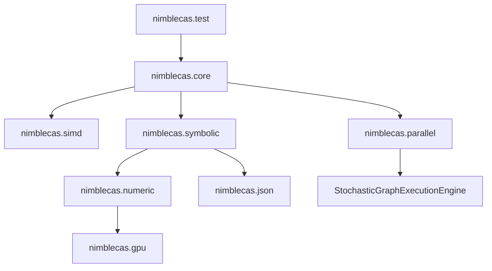

# NimbleCAS Technical Implementation Plan & Roadmap

This document defines the C++23 technical architecture, class interfaces, module structures, and implementation methodologies for **NimbleCAS**, as well as the path to scaling it across local CPUs, multiple GPUs, and distributed clusters.

---

## 1. System Architecture & C++23 Modules

NimbleCAS is designed from the ground up using **C++23 Modules** to enforce clean boundaries, maximize compilation speed, and prevent macro leakage.



### Module Declarations
- **`nimblecas.core`**: Exports basic types, constants, alignment helpers, and utility classes.
- **`nimblecas.simd`**: Dynamic SIMD vectorization engine (AVX-512, AVX2, SSE2, Scalar fallbacks).
- **`nimblecas.parallel`**: Concurrency layer wrapping Microsoft PPL on Windows and the distributed engine.
- **`nimblecas.symbolic`**: The core symbolic algebra engine based on Joel Cohen's models.
- **`nimblecas.numeric`**: Numerical solvers, matrices, and BF16/FP32 calculation routines.
- **`nimblecas.gpu`**: CUDA and accelerator offloading kernels.
- **`nimblecas.json`**: Integration with `fastestjsoninthewest` for serialization.

---

## 2. Symbolic Engine & Expression Trees (Joel S. Cohen Guide)

Expressions are represented as trees of node structures wrapped in a **Copy-on-Write (COW)** pointer to ensure thread safety and low copying cost.

### 2.1. Copy-on-Write Pointer Class (`CowPtr`)
To prevent memory leaks and minimize copy overhead, a template class `CowPtr` is defined:

```cpp
export module nimblecas.core;
import std;

export namespace nimblecas {
    template <typename T>
    class CowPtr {
    private:
        std::shared_ptr<const T> m_ptr;

    public:
        using element_type = T;

        auto write() -> T& {
            if (m_ptr.use_count() > 1) {
                m_ptr = std::make_shared<const T>(*m_ptr);
            }
            return const_cast<T&>(*m_ptr);
        }

        auto read() const -> const T& {
            return *m_ptr;
        }

        template <typename... Args>
        static auto make(Args&&... args) -> CowPtr<T> {
            CowPtr<T> ptr;
            ptr.m_ptr = std::make_shared<const T>(std::forward<Args>(args)...);
            return ptr;
        }

        auto operator->() const -> const T* { return m_ptr.get(); }
        auto operator*() const -> const T& { return *m_ptr; }
    };
}
```

### 2.2. Expression Hierarchy using `std::variant`
No inheritance hierarchy is used. Instead, a node is a type-safe union (`std::variant`) to keep structures small and cache-friendly.

```cpp
export module nimblecas.symbolic;
import std;
import nimblecas.core;

export namespace nimblecas {

    struct SymbolNode {
        std::string name;
    };

    struct ConstantNode {
        std::variant<std::int64_t, double, std::pair<std::int64_t, std::int64_t>> val; // Integer, Float, or Rational
    };

    struct AddNode;
    struct MulNode;
    struct PowerNode;
    struct FunctionNode;

    using ExprNode = std::variant<
        SymbolNode,
        ConstantNode,
        std::unique_ptr<AddNode>,
        std::unique_ptr<MulNode>,
        std::unique_ptr<PowerNode>,
        std::unique_ptr<FunctionNode>
    >;

    class Expr {
    private:
        CowPtr<ExprNode> m_node;

    public:
        explicit Expr(ExprNode node) : m_node(CowPtr<ExprNode>::make(std::move(node))) {}

        auto node() const -> const ExprNode& { return m_node.read(); }
        auto write_node() -> ExprNode& { return m_node.write(); }

        // Fluent API / Trailing Return Type style
        auto add(const Expr& other) const -> Expr;
        auto mul(const Expr& other) const -> Expr;
        auto pow(const Expr& other) const -> Expr;
        auto simplify() const -> Expr;
    };

    struct AddNode {
        std::vector<Expr> terms;
    };

    struct MulNode {
        std::vector<Expr> factors;
    };

    struct PowerNode {
        Expr base;
        Expr exponent;
    };

    struct FunctionNode {
        std::string name;
        std::vector<Expr> args;
    };
}
```

### 2.3. Cohen Algorithmic Implementations

#### `FreeOf(u, t)`
Determines if expression $u$ does not contain sub-expression $t$.
```cpp
auto free_of(const Expr& u, const Expr& t) -> bool {
    if (u.is_equivalent_to(t)) return false;
    return std::visit([&t](const auto& node) -> bool {
        using T = std::decay_t<decltype(node)>;
        if constexpr (std::is_same_v<T, SymbolNode> || std::is_same_v<T, ConstantNode>) {
            return true;
        } else if constexpr (std::is_same_v<T, std::unique_ptr<AddNode>>) {
            return std::ranges::all_of(node->terms, [&t](const auto& term) { return free_of(term, t); });
        } else if constexpr (std::is_same_v<T, std::unique_ptr<MulNode>>) {
            return std::ranges::all_of(node->factors, [&t](const auto& factor) { return free_of(factor, t); });
        } else if constexpr (std::is_same_v<T, std::unique_ptr<PowerNode>>) {
            return free_of(node->base, t) && free_of(node->exponent, t);
        } else if constexpr (std::is_same_v<T, std::unique_ptr<FunctionNode>>) {
            return std::ranges::all_of(node->args, [&t](const auto& arg) { return free_of(arg, t); });
        }
    }, u.node());
}
```

#### `Substitute(u, t, r)`
Replaces all instances of sub-expression $t$ with $r$ in $u$.
```cpp
auto substitute(const Expr& u, const Expr& t, const Expr& r) -> Expr {
    if (u.is_equivalent_to(t)) return r;
    return std::visit([&t, &r](const auto& node) -> Expr {
        using T = std::decay_t<decltype(node)>;
        if constexpr (std::is_same_v<T, SymbolNode> || std::is_same_v<T, ConstantNode>) {
            return Expr(node);
        } else if constexpr (std::is_same_v<T, std::unique_ptr<AddNode>>) {
            std::vector<Expr> new_terms;
            for (const auto& term : node->terms) {
                new_terms.push_back(substitute(term, t, r));
            }
            return Expr(std::make_unique<AddNode>(std::move(new_terms)));
        } // Similarly for MulNode, PowerNode, and FunctionNode
    }, u.node());
}
```

#### Automatic Simplification (`simplify`)
Automatic simplification applies mathematical invariants recursively:
1. Addition identity: $u + 0 \to u$.
2. Multiplication identities: $u \cdot 1 \to u$, $u \cdot 0 \to 0$.
3. Exponentiation rules: $u^1 \to u$, $u^0 \to 1$.
4. Polynomial ordering: Sort variables lexically (e.g., $y + x \to x + y$) to achieve a canonical form.

---

## 3. Parallel Patterns Library (PPL) on Windows

Windows concurrency utilizes the Microsoft Concurrency Runtime's PPL to leverage multi-threaded CPU cores without OpenMP.

```cpp
export module nimblecas.parallel;
import std;
import <ppl.h>; // PPL headers

export namespace nimblecas {
    // Parallel evaluation helper using PPL task group
    template <typename Func>
    auto run_in_parallel(Func&& func1, Func&& func2) -> void {
        concurrency::parallel_invoke(
            std::forward<Func>(func1),
            std::forward<Func>(func2)
        );
    }

    // Parallel grid mapping
    template <typename T, typename MapFunc>
    auto parallel_map(std::span<T> data, MapFunc&& mapper) -> void {
        concurrency::parallel_for(size_t{0}, data.size(), [&data, &mapper](size_t i) {
            data[i] = mapper(data[i]);
        });
    }
}
```

---

## 4. Multiregister SIMD Engine with Dynamic Dispatch

Numerical operations (such as polynomial coefficient multiplication and matrix algebra) are vectorized. At runtime, the best register paths are selected via pointer-based or conditional dynamic dispatch.

```cpp
export module nimblecas.simd;
import std;

export namespace nimblecas {
    enum class SIMDArchitecture {
        AVX512,
        AVX2,
        SSE2,
        Scalar
    };

    // Global selector determined once at process startup
    auto detect_simd_support() -> SIMDArchitecture {
        // Query CPUID
        return SIMDArchitecture::AVX2;
    }

    // Interface definition
    struct SIMDOperations {
        auto (*add_arrays)(const float* a, const float* b, float* c, std::size_t size) -> void;
    };

    // SSE2 Path
    auto add_arrays_sse2(const float* a, const float* b, float* c, std::size_t size) -> void {
        // SSE2 implementations
    }

    // AVX2 Path
    auto add_arrays_avx2(const float* a, const float* b, float* c, std::size_t size) -> void {
        // AVX2 implementations
    }

    // AVX512 Path (requires compiler attributes as per Code Policy Rule 50)
    [[gnu::target("avx512f,avx512dq,fma")]]
    auto add_arrays_avx512(const float* a, const float* b, float* c, std::size_t size) -> void {
        // AVX-512 implementation
    }

    // Scalar fallback
    auto add_arrays_scalar(const float* a, const float* b, float* c, std::size_t size) -> void {
        for (std::size_t i = 0; i < size; ++i) {
            c[i] = a[i] + b[i];
        }
    }

    // Dynamic Dispatcher class
    class SIMDDispatcher {
    public:
        SIMDOperations ops;

        explicit SIMDDispatcher() {
            auto arch = detect_simd_support();
            if (arch == SIMDArchitecture::AVX512) {
                ops.add_arrays = &add_arrays_avx512;
            } else if (arch == SIMDArchitecture::AVX2) {
                ops.add_arrays = &add_arrays_avx2;
            } else if (arch == SIMDArchitecture::SSE2) {
                ops.add_arrays = &add_arrays_sse2;
            } else {
                ops.add_arrays = &add_arrays_scalar;
            }
        }
    };
}
```

---

## 5. Local GPU Offloading (Single / Multi-GPU)

For intensive numerical calculations, NimbleCAS implements a co-processing pipeline using local GPUs.

- **Dynamic Kernel Code-Generation**: When evaluating symbolic expressions over millions of points, the symbolic AST compiles itself into a GLSL/HLSL/CUDA source code fragment.
- **Asynchronous Execution Streams**: We use non-default streams (`cudaStream_t`) to execute numerical evaluations concurrently on a single GPU.
- **Multi-GPU Scaling**: We partition large matrices or numerical grid arrays across available GPUs. Memory transfers between GPUs are managed using peer-to-peer copies (`cudaMemcpyPeerAsync`) to avoid rounding back through CPU host RAM.

---

## 6. Distributed Scaling (CPU + Multi-GPU) via StochasticGraphExecutionEngine

To scale beyond a single node, NimbleCAS integrates with **`StochasticGraphExecutionEngine`** (`https://github.com/oldboldpilot/StochasticGraphExecutionEngine`) to execute distributed evaluation graphs.

### 6.1. Computation Graph Modeling
We represent large symbolic-numeric computations (e.g. Monte Carlo simulations of systems of differential equations, or wide parameter sweeps of algebraic formulas) as a Directed Acyclic Graph (DAG) using the stochastic task graph structures:
- **Tasks**: Nodes in the graph represent tasks (e.g. symbolic simplifications, polynomial factorization, numerical evaluation of matrices).
- **Stochastic Duration Model**: Task nodes carry execution time estimates and variance models. The scheduler uses these metrics to optimize workload distribution dynamically.
- **Hardware Affinities**: Each node declares its computational affinity:
  - **`CPU_ONLY`**: Runs via local/remote PPL + SIMD threads.
  - **`GPU_ONLY`**: Runs via local/remote CUDA execution paths.
  - **`HYBRID`**: Runs on whichever resource is free.

### 6.2. Multi-GPU and CPU Scheduling Matrix
The execution of the computation graph is scheduled stochastically across heterogeneous hardware resources:

```
[StochasticGraphExecutionEngine Scheduler]
           |
           +---> [PPL Thread Pool] --------> CPU Core 0 .. N
           |
           +---> [Local GPU Dispatcher] ----> GPU 0, GPU 1 .. M (via Peer-to-Peer CUDA)
           |
           +---> [Distributed Network] -----> Remote Node Workers (via Gitea/GitHub Deployments)
```

1. **Local Scaling**: The scheduler distributes task graph nodes to local PPL CPU threads and local GPU devices concurrently.
2. **Distributed Scaling**: Tasks are serialized to JSON using `fastestjsoninthewest`, transmitted over TCP/IP endpoints to remote machine pools, executed, and the results are asynchronously gathered back.
3. **Data Locality Optimization**: The engine minimizes data copying by prioritizing scheduling of downstream tasks on the exact same GPU or node holding the parent data.

---

## 7. Railway-Oriented Error Handling

To satisfy Code Policy Rule 32, we reject C++ exceptions and use `std::expected` for monad-style error handling.

```cpp
export module nimblecas.core;
import std;

export namespace nimblecas {
    enum class MathError {
        DivisionByZero,
        UndefinedValue,
        Overflow,
        SyntaxError
    };

    template <typename T>
    using Result = std::expected<T, MathError>;

    // Railway implementation example
    auto divide(double numerator, double denominator) -> Result<double> {
        if (denominator == 0.0) {
            return std::unexpected(MathError::DivisionByZero);
        }
        return numerator / denominator;
    }

    auto compute_sqrt(double value) -> Result<double> {
        if (value < 0.0) {
            return std::unexpected(MathError::UndefinedValue);
        }
        return std::sqrt(value);
    }

    // Chaining operations (railway oriented programming)
    auto evaluate_pipeline(double a, double b) -> Result<double> {
        return divide(a, b)
            .and_then(compute_sqrt)
            .transform([](double val) { return val * 2.0; });
    }
}
```

---

## 8. XOR & Binary Fuse Filters

In order to check membership of functions or variables quickly without accessing hash maps (Code Policy Rule 44):
- **Implementation**: We construct a compact Binary Fuse Filter containing the hash signatures of predefined functions (`sin`, `cos`, `tan`, `log`, etc.).
- **Usage**: When parsing variables and matching function signatures, we perform a binary fuse lookup first. If the filter returns false, we instantly know it is a custom user-defined variable without scanning maps.

---

## 9. Build System and Canonical Flags

As required by Rule 50, all C++ files are built using CMake and Ninja using the canonical build parameters.

```cmake
# CMakeLists.txt snippet
cmake_minimum_required(VERSION 3.28)
project(NimbleCAS LANGUAGES CXX)

set(CMAKE_CXX_STANDARD 23)
set(CMAKE_CXX_STANDARD_REQUIRED ON)

# Canonical flags compiled for Windows Target Clang-22
set(CANONICAL_FLAGS
    "-std=c++23"
    "-stdlib=libc++"
    "-fPIC"
    "-O3"
    "-march=x86-64-v3"
    "-mtune=generic"
    "-mavx"
    "-mavx2"
    "-mfma"
    "-pthread"
    "-fstack-protector-strong"
    "-DNDEBUG"
    "-D_LIBCPP_ENABLE_EXPERIMENTAL"
    "-fexperimental-library"
    "-nostdinc++"
    "-isystem ${CMAKE_SOURCE_DIR}/external/libcxx-v1/include"
)

add_compile_options(${CANONICAL_FLAGS})
```

---

## 10. Implementation Phases & Roadmap Timeline

| Phase | Title | Description | Est. Time |
| :--- | :--- | :--- | :--- |
| **Phase 1** | **Core Framework** | Setup CMake, vendored libc++, custom internal test framework. | 1 Week |
| **Phase 2** | **Symbolic Basics** | Implement `CowPtr`, `ExprNode` variant, `FreeOf`, `Substitute` (Cohen guide). | 2 Weeks |
| **Phase 3** | **Simplifier & Poly** | Automatic simplification rules, polynomial expansion, GCD subresultants. | 3 Weeks |
| **Phase 4** | **PPL & SIMD Core** | Microsoft PPL task system, dynamic SIMD dispatcher class, matrix algorithms. | 2 Weeks |
| **Phase 5** | **Multi-GPU Engine** | Asynchronous execution streams, Peer-to-Peer multi-GPU copy pipelines. | 2 Weeks |
| **Phase 6** | **Distributed Engine** | Integrate `StochasticGraphExecutionEngine` for distributed DAG scheduling. | 2 Weeks |
| **Phase 7** | **JSON & Bindings** | `fastestjsoninthewest` serialization and nanobind interface. | 1 Week |
| **Phase 8** | **Hardening** | Valgrind, Sanitizers (ASan/UBSan), performance profiling using Nsight/perf. | 1 Week |
