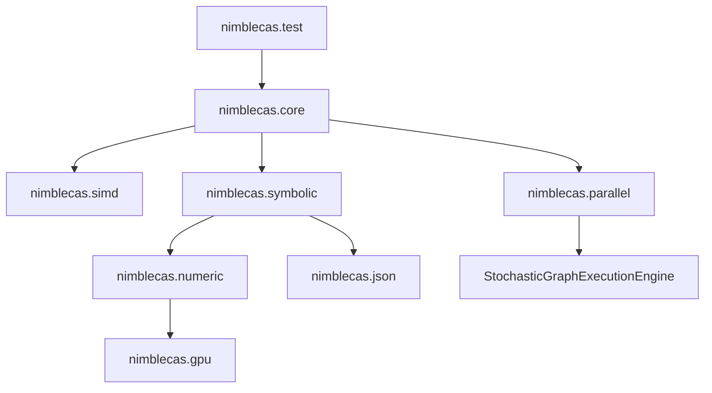

# NimbleCAS Technical Implementation Plan & Roadmap

This document defines the C++23 technical architecture, class interfaces, module structures, and implementation methodologies for **NimbleCAS**, as well as the path to scaling it across local CPUs, multiple GPUs, and distributed clusters.

---

## 1. System Architecture & C++23 Modules

NimbleCAS is designed from the ground up using **C++23 Modules** to enforce clean boundaries, maximize compilation speed, and prevent macro leakage.



### Module Declarations
- **`nimblecas.core`**: Exports basic types, constants, alignment helpers, and utility classes.
- **`nimblecas.simd`**: Dynamic SIMD vectorization engine (AVX-512, AVX2, SSE2, Scalar fallbacks).
- **`nimblecas.parallel`**: Concurrency layer wrapping Microsoft PPL on Windows and the distributed engine.
- **`nimblecas.symbolic`**: The core symbolic algebra engine based on Joel Cohen's models.
- **`nimblecas.numeric`**: Numerical solvers, matrices, and BF16/FP32 calculation routines.
- **`nimblecas.gpu`**: CUDA and accelerator offloading kernels.
- **`nimblecas.json`**: Integration with `fastestjsoninthewest` for serialization.

---

## 2. Symbolic Engine & Expression Trees (Joel S. Cohen Guide)

Expressions are represented as trees of node structures wrapped in a **Copy-on-Write (COW)** pointer to ensure thread safety and low copying cost.

### 2.1. Copy-on-Write Pointer Class (`CowPtr`)
To prevent memory leaks and minimize copy overhead, a template class `CowPtr` is defined:

```cpp
export module nimblecas.core;
import std;

export namespace nimblecas {
    template <typename T>
    class CowPtr {
    private:
        std::shared_ptr<const T> m_ptr;

    public:
        using element_type = T;

        auto write() -> T& {
            if (m_ptr.use_count() > 1) {
                m_ptr = std::make_shared<const T>(*m_ptr);
            }
            return const_cast<T&>(*m_ptr);
        }

        auto read() const -> const T& {
            return *m_ptr;
        }

        template <typename... Args>
        static auto make(Args&&... args) -> CowPtr<T> {
            CowPtr<T> ptr;
            ptr.m_ptr = std::make_shared<const T>(std::forward<Args>(args)...);
            return ptr;
        }

        auto operator->() const -> const T* { return m_ptr.get(); }
        auto operator*() const -> const T& { return *m_ptr; }
    };
}
```

### 2.2. Expression Hierarchy using `std::variant`
No inheritance hierarchy is used. Instead, a node is a type-safe union (`std::variant`) to keep structures small and cache-friendly.

```cpp
export module nimblecas.symbolic;
import std;
import nimblecas.core;

export namespace nimblecas {

    struct SymbolNode {
        std::string name;
    };

    struct ConstantNode {
        std::variant<std::int64_t, double, std::pair<std::int64_t, std::int64_t>> val; // Integer, Float, or Rational
    };

    struct AddNode;
    struct MulNode;
    struct PowerNode;
    struct FunctionNode;

    using ExprNode = std::variant<
        SymbolNode,
        ConstantNode,
        std::unique_ptr<AddNode>,
        std::unique_ptr<MulNode>,
        std::unique_ptr<PowerNode>,
        std::unique_ptr<FunctionNode>
    >;

    class Expr {
    private:
        CowPtr<ExprNode> m_node;

    public:
        explicit Expr(ExprNode node) : m_node(CowPtr<ExprNode>::make(std::move(node))) {}

        auto node() const -> const ExprNode& { return m_node.read(); }
        auto write_node() -> ExprNode& { return m_node.write(); }

        // Fluent API / Trailing Return Type style
        auto add(const Expr& other) const -> Expr;
        auto mul(const Expr& other) const -> Expr;
        auto pow(const Expr& other) const -> Expr;
        auto simplify() const -> Expr;
    };

    struct AddNode {
        std::vector<Expr> terms;
    };

    struct MulNode {
        std::vector<Expr> factors;
    };

    struct PowerNode {
        Expr base;
        Expr exponent;
    };

    struct FunctionNode {
        std::string name;
        std::vector<Expr> args;
    };
}
```

### 2.3. Cohen Algorithmic Implementations

#### `FreeOf(u, t)`
Determines if expression $u$ does not contain sub-expression $t$.
```cpp
auto free_of(const Expr& u, const Expr& t) -> bool {
    if (u.is_equivalent_to(t)) return false;
    return std::visit([&t](const auto& node) -> bool {
        using T = std::decay_t<decltype(node)>;
        if constexpr (std::is_same_v<T, SymbolNode> || std::is_same_v<T, ConstantNode>) {
            return true;
        } else if constexpr (std::is_same_v<T, std::unique_ptr<AddNode>>) {
            return std::ranges::all_of(node->terms, [&t](const auto& term) { return free_of(term, t); });
        } else if constexpr (std::is_same_v<T, std::unique_ptr<MulNode>>) {
            return std::ranges::all_of(node->factors, [&t](const auto& factor) { return free_of(factor, t); });
        } else if constexpr (std::is_same_v<T, std::unique_ptr<PowerNode>>) {
            return free_of(node->base, t) && free_of(node->exponent, t);
        } else if constexpr (std::is_same_v<T, std::unique_ptr<FunctionNode>>) {
            return std::ranges::all_of(node->args, [&t](const auto& arg) { return free_of(arg, t); });
        }
    }, u.node());
}
```

#### `Substitute(u, t, r)`
Replaces all instances of sub-expression $t$ with $r$ in $u$.
```cpp
auto substitute(const Expr& u, const Expr& t, const Expr& r) -> Expr {
    if (u.is_equivalent_to(t)) return r;
    return std::visit([&t, &r](const auto& node) -> Expr {
        using T = std::decay_t<decltype(node)>;
        if constexpr (std::is_same_v<T, SymbolNode> || std::is_same_v<T, ConstantNode>) {
            return Expr(node);
        } else if constexpr (std::is_same_v<T, std::unique_ptr<AddNode>>) {
            std::vector<Expr> new_terms;
            for (const auto& term : node->terms) {
                new_terms.push_back(substitute(term, t, r));
            }
            return Expr(std::make_unique<AddNode>(std::move(new_terms)));
        } // Similarly for MulNode, PowerNode, and FunctionNode
    }, u.node());
}
```

#### Automatic Simplification (`simplify`)
Automatic simplification applies mathematical invariants recursively:
1. Addition identity: $u + 0 \to u$.
2. Multiplication identities: $u \cdot 1 \to u$, $u \cdot 0 \to 0$.
3. Exponentiation rules: $u^1 \to u$, $u^0 \to 1$.
4. Polynomial ordering: Sort variables lexically (e.g., $y + x \to x + y$) to achieve a canonical form.

---

## 3. Cross-Platform CPU Concurrency (PPL / TBB)

NimbleCAS implements a unified parallel abstraction layer. Concurrency maps to **Intel oneTBB** as the default parallel library on all non-Windows systems, while Windows targets leverage the Microsoft Concurrency Runtime's **Parallel Patterns Library (PPL)**.

```cpp
export module nimblecas.parallel;
import std;

#ifdef _WIN32
import <ppl.h>; // PPL for Windows
#else
import <tbb/parallel_invoke.h>; // Intel oneTBB as default
import <tbb/parallel_for.h>;
#endif

export namespace nimblecas {
    // Parallel evaluation helper
    template <typename Func>
    auto run_in_parallel(Func&& func1, Func&& func2) -> void {
        #ifdef _WIN32
        concurrency::parallel_invoke(
            std::forward<Func>(func1),
            std::forward<Func>(func2)
        );
        #else
        tbb::parallel_invoke(
            std::forward<Func>(func1),
            std::forward<Func>(func2)
        );
        #endif
    }

    // Parallel transformation mapping with support for C++20/C++23 lazy views
    template <typename R, typename MapFunc>
    requires std::ranges::random_access_range<R> && std::ranges::sized_range<R>
    auto parallel_transform(R&& range, MapFunc&& mapper) -> void {
        const size_t size = std::ranges::size(range);
        #ifdef _WIN32
        concurrency::parallel_for(size_t{0}, size, [&range, &mapper](size_t i) {
            range[i] = mapper(range[i]);
        });
        #else
        tbb::parallel_for(size_t{0}, size, [&range, &mapper](size_t i) {
            range[i] = mapper(range[i]);
        });
        #endif
    }
}
```

---

## 4. Multiregister SIMD Engine with Dynamic Dispatch

Numerical operations (such as polynomial coefficient multiplication and matrix algebra) are vectorized. At runtime, the best register paths are selected via pointer-based or conditional dynamic dispatch.

```cpp
export module nimblecas.simd;
import std;

export namespace nimblecas {
    enum class SIMDArchitecture {
        AVX512,
        AVX2,
        SSE2,
        Scalar
    };

    // Global selector determined once at process startup
    auto detect_simd_support() -> SIMDArchitecture {
        // Query CPUID
        return SIMDArchitecture::AVX2;
    }

    // Interface definition
    struct SIMDOperations {
        auto (*add_arrays)(const float* a, const float* b, float* c, std::size_t size) -> void;
    };

    // SSE2 Path
    auto add_arrays_sse2(const float* a, const float* b, float* c, std::size_t size) -> void {
        // SSE2 implementations
    }

    // AVX2 Path
    auto add_arrays_avx2(const float* a, const float* b, float* c, std::size_t size) -> void {
        // AVX2 implementations
    }

    // AVX512 Path (requires compiler attributes as per Code Policy Rule 50)
    [[gnu::target("avx512f,avx512dq,fma")]]
    auto add_arrays_avx512(const float* a, const float* b, float* c, std::size_t size) -> void {
        // AVX-512 implementation
    }

    // Scalar fallback
    auto add_arrays_scalar(const float* a, const float* b, float* c, std::size_t size) -> void {
        for (std::size_t i = 0; i < size; ++i) {
            c[i] = a[i] + b[i];
        }
    }

    // Dynamic Dispatcher class
    class SIMDDispatcher {
    public:
        SIMDOperations ops;

        explicit SIMDDispatcher() {
            auto arch = detect_simd_support();
            if (arch == SIMDArchitecture::AVX512) {
                ops.add_arrays = &add_arrays_avx512;
            } else if (arch == SIMDArchitecture::AVX2) {
                ops.add_arrays = &add_arrays_avx2;
            } else if (arch == SIMDArchitecture::SSE2) {
                ops.add_arrays = &add_arrays_sse2;
            } else {
                ops.add_arrays = &add_arrays_scalar;
            }
        }
    };
}
```

---

## 5. Parallel & GPU-Accelerated Symbolic Engine (JIT & Flat Polish Notation)

NimbleCAS implements advanced hardware acceleration to shift bottlenecks in symbolic algebra from the CPU to local GPU resources.

### 5.1. Runtime Code Generation (JIT Compilation via NVRTC)
Dynamic pointer-heavy expression trees are inefficient for the GPU due to memory access divergence. To solve this:
- **Kernel Compilation**: The CPU simplifies the symbolic tree and compiles the expression at runtime into CUDA source code using **NVIDIA Runtime Compilation (NVRTC)**.
- **Grid Evaluation**: The compiled kernel is loaded dynamically and executed on the GPU, evaluating the expression concurrently over millions of elements.

### 5.2. Flattened Polish Stacks for Symbolic Parallelism
For pure symbolic evaluations (e.g. pattern matching or subterm search) on the GPU:
- **Linearization**: Pointer-based trees are flattened into contiguous arrays using Polish prefix/postfix notation (e.g., $x^2 + 5$ becomes `[Add, Pow, Sym(x), Const(2), Const(5)]`).
- **Parallel Scanning**: Multiple GPU threads scan these contiguous stack buffers concurrently using GPU-coalesced memory accesses, eliminating tree traversal branch divergence.

### 5.3. Modular Polynomial Arithmetic on the GPU
Multivariate polynomial GCD and resultant calculations are parallelized via modular reduction:
1. **Modular Splitting**: The polynomial is split into independent images modulo several primes $p_i$.
2. **GPU Arithmetic**: GPU threads compute the GCD of the modular images in parallel. To avoid the high cost of integer division on the GPU, modular reductions utilize **Montgomery multiplication** or **Barrett reduction**.
3. **Reconstruction**: The GPU performs a parallelized **Chinese Remainder Theorem (CRT)** or **Mixed-Radix Conversion (MRC)** to reconstruct the final integer coefficients of the polynomial GCD.

### 5.4. Triton-Based Math Kernels & Multi-GPU Scale
For heavy parallelized numeric evaluations (such as simulating $10^6$ Euler-Maruyama SDE paths, calculating dense Lyapunov exponents, or executing Daubechies DWT filters):
- **Triton Python API**: Custom math kernels are written in **OpenAI's Triton** syntax. The Triton compiler automatically generates optimized LLVM IR and PTX code.
- **Triton Advantages**: Automatically handles memory coalescing, block-level execution scheduling, and shared memory management, producing kernels that rival hand-tuned CUDA.
- **Multi-GPU Parallelism**: The `nimblecas.gpu` layer launches independent Triton execution streams across multiple local GPUs concurrently, using PyTorch/CUDA multi-stream orchestration.

---

## 6. Distributed Symbolic Scaling via StochasticGraphExecutionEngine

To scale computations beyond a single node, NimbleCAS distributes computation tasks using the **`StochasticGraphExecutionEngine`** (`https://github.com/oldboldpilot/StochasticGraphExecutionEngine`).

### 6.1. Computation Graph Modeling
We represent complex symbolic-numeric systems (such as high-order Homotopy Analysis Method expansions or massive ODE/SDE parameter sweeps) as a Directed Acyclic Graph (DAG) using the stochastic task graph structures:
- **Tasks**: Nodes represent tasks (e.g. computing Adomian Polynomials, solving modular polynomial images, or running SDE paths).
- **Stochastic Scheduling**: Task nodes carry execution time estimates and variance models. The scheduler dynamically balances loads across local PPL CPU threads, local GPUs, and remote cluster workers.
- **Hardware Affinities**: Nodes declare affinities: `CPU_ONLY`, `GPU_ONLY`, or `HYBRID`.

### 6.2. Distributed Modular Computations and Memoization
The distributed scheduler optimizes symbolic execution using algebraic properties:
1. **Distributed Modular GCD**: The coordinator broadcasts modular polynomial GCD images (modulo different primes $p_i$) across the cluster. Remote nodes compute modular images independently, and the coordinator merges results.
2. **Distributed Hash-Consing**: The cluster implements a distributed memoization key-value table. Simplified sub-expressions are hashed and cached across the network, preventing redundant symbolic simplifications.
3. **Data Locality Optimization**: Tasks are scheduled on nodes that already hold parent datasets (e.g. a downstream matrix calculation is scheduled on the specific GPU holding the parent matrix) to minimize inter-node TCP/IP or PCIe transfers.

---

## 7. Advanced Math & Analytical Solvers (including Esoterica)

NimbleCAS extends Joel Cohen's core symbolic algebra engine to support advanced mathematical branches and analytical approximation methods for non-linear systems.

### 7.1. Special Functions and Complex Numbers
- **Lambert W Function (`lambertW(z)`)**:
  - **Representation**: A `LambertWNode` holding a sub-expression $z$ and a branch integer $k \in \{0, -1\}$.
  - **Evaluation**: Evaluated analytically using Taylor series around $z=0$ for $|z| < \frac{1}{e}$. For complex or large values, Halley's numerical iteration method is executed in the complex plane:
    $$w_{n+1} = w_n - \frac{w_n e^{w_n} - z}{e^{w_n}(w_n + 1) - \frac{(w_n + 2)(w_n e^{w_n} - z)}{2w_n + 2}}$$
- **Complex Numbers**:
  - **Representation**: A `ComplexNode` containing real and imaginary parts ($x + i y$) represented as recursive expression sub-trees.
  - **Identities**: Automatic simplification handles branch cuts, complex conjugation ($\bar{z}$), residues, and Euler's formula conversion ($e^{i \theta} \to \cos \theta + i \sin \theta$).

### 7.2. Linear Algebra, Decompositions, and Iterative Solvers
- **Symbolic Matrices**: A `MatrixNode` containing a 2D vector of sub-expressions.
- **Cholesky Decomposition**: Computes the Cholesky factor $L$ of a symmetric positive-definite matrix $A$ ($A = L L^T$) using:
  $$L_{j,j} = \sqrt{A_{j,j} - \sum_{k=1}^{j-1} L_{j,k}^2}, \quad L_{i,j} = \frac{1}{L_{j,j}} \left( A_{i,j} - \sum_{k=1}^{j-1} L_{i,k} L_{j,k} \right) \text{ for } i > j$$
  parallelized over CPU registers (AVX-512) and GPU warps.
- **Eigenvalue Solvers**:
  - **Dense QR Algorithm**: Computes all eigenvalues via iterative QR decompositions ($A_k = Q_k R_k$, $A_{k+1} = R_k Q_k$) using Householder reflections.
  - **Lanczos Iteration**: Tridiagonalizes large symmetric matrices $A$ to extract extreme eigenvalues (Ritz values) with low memory footprint.
  - **Arnoldi Iteration**: Builds an orthonormal basis of the Krylov subspace for general non-symmetric matrices, computing upper Hessenberg matrices to solve generalized eigenvalue problems.
- **Iterative Linear Solvers**: Solves large sparse systems $A x = b$:
  - **Stationary Methods**: Jacobi, Gauss-Seidel, and Successive Over-Relaxation (SOR) with dynamic relaxation parameters $\omega$.
  - **Krylov Subspace Solvers**: Conjugate Gradient (CG) for positive-definite systems, GMRES with Gram-Schmidt orthogonalization, and BiCGSTAB for general sparse systems, utilizing block Jacobi preconditioners.

### 7.3. Series, Transforms, Wavelets, and Spectral Methods
- **Taylor, Laurent, and Puiseux Series**: Computes asymptotic expansions around $x = a$ up to order $n$ using symbolic differentiation and recursive coefficients.
- **Wavelets**: Modules for Continuous Wavelet Transform (CWT) and Discrete Wavelet Transform (DWT), containing precompiled filters (Haar, Daubechies 4/8, Morlet) optimized via SIMD vector registers.
- **Spectral Methods**: Solves differential equations numerically by representing the solution $u(x)$ as a sum of global basis functions:
  - **Fourier Collocation**: Used for periodic boundary conditions, evaluating spatial derivatives via the Discrete Fourier Transform (FFT) on the GPU.
  - **Chebyshev Collocation**: Used for non-periodic boundaries, mapping grid points to Chebyshev-Gauss-Lobatto nodes $x_j = \cos(\pi j / N)$ and computing spatial derivatives via Chebyshev differentiation matrices.

### 7.4. Singular Perturbation of ODEs
- **Matched Asymptotic Expansions**: Solves boundary layer problems of the form $\epsilon y'' + p(x)y' + q(x)y = 0$.
- **Implementation**:
  1. Identifies singular perturbation terms by searching for parameter symbol $\epsilon$ multiplying high-order derivatives.
  2. Solves the **Outer Expansion** by setting $\epsilon = 0$.
  3. Solves the **Inner Expansion** in the boundary layer by introducing the stretched coordinate $\tilde{x} = \frac{x-a}{\epsilon^\alpha}$.
  4. Automatically matches coefficients using Prandtl's matching condition.

### 7.5. Homotopy Methods (HAM, ADM, HPM, HAP)
For highly non-linear differential equations where classical perturbation methods fail, NimbleCAS implements symbolic solvers using homotopy expansions.

#### 1. Homotopy Analysis Method (HAM)
- Constructs a continuous mapping from an initial guess $u_0(t)$ to the exact solution $u(t)$.
- **Deformation Equation**:
  $$(1-p)\mathcal{L}[\phi(t;p) - u_0(t)] = p h \mathcal{H}(t) \mathcal{N}[\phi(t;p)]$$
  where $p \in [0, 1]$ is the embedding parameter, $h$ is the auxiliary parameter (used to plot the $h$-curves to determine convergence), $\mathcal{L}$ is the auxiliary linear operator, and $\mathcal{N}$ is the non-linear operator.
- **Solver**: Symbolically differentiates the deformation equation $m$ times with respect to $p$, divides by $m!$, sets $p=0$, and solves the resulting linear equations recursively.

#### 2. Adomian Decomposition Method (ADM)
- Decomposes the solution as $u = \sum_{n=0}^{\infty} u_n$ and the non-linear term $N(u) = \sum_{n=0}^{\infty} A_n$ where $A_n$ are the **Adomian Polynomials**.
- **Polynomial Generation**:
  $$A_n = \frac{1}{n!} \left[ \frac{d^n}{dp^n} N\left( \sum_{i=0}^{\infty} p^i u_i \right) \right]_{p=0}$$
- **Solver**: NimbleCAS recursively computes $A_n$ symbolically using higher-order symbolic differentiation and solves:
  $$u_{n+1} = L^{-1}(A_n)$$
  where $L^{-1}$ is the integral operator.

#### 3. Homotopy Perturbation Method (HPM) and Homotopy Analysis Protocol (HAP)
- Combines perturbation theory with homotopy, constructing:
  $$H(u, p) = (1-p)[L(u) - L(u_0)] + p[A(u) - f(r)] = 0$$
- Solves the sequence of linear problems for each coefficient of $p^k$, executing the **Homotopy Analysis Protocol (HAP)** to verify the boundaries of convergence.

#### 4. Padé Approximations
- Computes rational approximations $[M/N](x)$ of a symbolic function around $x=0$ by extracting its Taylor expansion $f(x) = \sum_{k=0}^{M+N} c_k x^k$.
- Solves the Hankel matrix system of linear equations for denominator coefficients $q_i$ and computes numerator coefficients $p_j$ using:
  $$\sum_{j=0}^{k} c_{k-j} q_j = p_k \quad (\text{with } q_0=1, q_i=0 \text{ for } i > N, p_j=0 \text{ for } j > M)$$
  utilizing dynamic SIMD execution for numeric coefficients.

#### 5. Continued Fractions
- Implementation of **Viskovatov's algorithm** to convert power series directly into continued fraction representations:
  $$f(x) \approx b_0 + \frac{a_1 x}{b_1 + \frac{a_2 x}{b_2 + \frac{a_3 x}{\dots}}}$$
- Evaluates the $n$-th convergent $A_n/B_n$ using the forward recurrence relation:
  $$A_n = b_n A_{n-1} + a_n x A_{n-2}, \quad B_n = b_n B_{n-1} + a_n x B_{n-2}$$
  to enable highly stable and fast numerical evaluation of special transcendental functions on the CPU and GPU.

### 7.6. Laplace Methods and Integral Transforms
- **Laplace Transforms**: Table-driven and rule-based forward and inverse Laplace transform algorithms, handling convolution theorem, delta functions, and step functions.
- **Laplace's Approximation Method**: Integrals of the form $I(M) = \int_a^b e^{M f(x)} g(x) dx$ are approximated asymptotically for large $M$ using:
  $$I(M) \approx \sqrt{\frac{2\pi}{M |f''(x_0)|}} e^{M f(x_0)} g(x_0)$$
  where $x_0 \in (a, b)$ is the unique point where $f(x)$ attains its maximum.

### 7.7. Probability and Generating Functions
- **Generating Functions**: Algebraic solvers to convert linear recurrence equations to generating functions $G(x) = \sum a_n x^n$. Computes Taylor series coefficients of rational/transcendental generating functions to find closed-form recurrence sequences.
- **Probability distributions**: Symbolic representation of continuous/discrete PDFs. Computes expected values and variances using symbolic integration:
  $$\mathbb{E}[X] = \int_{-\infty}^{\infty} x \cdot f(x) dx$$

### 7.8. Stochastic Differential Equations (SDEs and SPDEs)
- **Itô Calculus**: Multidimensional Itô lemma implementation:
  $$d f(t, X_t) = \left( \frac{\partial f}{\partial t} + \mu_t \frac{\partial f}{\partial x} + \frac{1}{2} \sigma_t^2 \frac{\partial^2 f}{\partial x^2} \right) dt + \sigma_t \frac{\partial f}{\partial x} d W_t$$
- **Euler-Maruyama & Milstein Simulation**: Numeric loops parallelized via PPL and compiled to GPU kernels for high-speed paths simulation of multi-asset SDEs.

### 7.9. Difference Equations and Recurrence Relations
- **Difference Equation Solvers**: Solver classes for $a_n y_{n+k} + \dots + a_0 y_n = f(n)$ using characteristic polynomials and Z-transforms.

### 7.10. Dynamical Systems, Chaos, and Stability
- **Fixed Points and Stability**: Evaluates steady states of non-linear vector fields $\dot{x} = f(x)$, constructs the symbolic Jacobian matrix $J$, computes eigenvalues at fixed points to determine local stability (sink, source, saddle, spiral), and solves bifurcation equations.
- **Chaos Numerics**: Optimized double-precision ODE integration solvers running parallelized on CPU and GPU to compute Lyapunov exponents and Poincaré sections.

### 7.11. Plotting and Visualization
- **Adaptive Grid Generation**: Implements adaptive mesh refinement (AMR) algorithms to automatically detect high-curvature regions and increase sample density (preventing jagged edges in steep slope functions).
- **DirectX/Vulkan Native Renderer**: High-performance native Windows rendering using vertex buffers generated directly on the GPU (e.g. from Triton SDE paths or matrix coordinate arrays), bypassing CPU read-back.
- **Interactive JSON Data Serialization**: For web environments (Jupyter/Python bindings), the plotting module formats data into highly optimized JSON structures parsed by frontend visualization libraries (e.g., WebGPU/WebGL-based Three.js or custom shaders).
- **Parameter Sweep Bindings**: Interacts with the `nimblecas.parallel` PPL task scheduler to recalculate surface mesh points on-the-fly as user-adjusted slider parameters vary.

### 7.12. LaTeX Math Exporter
- **AST to LaTeX Formatting**: Walks the symbolic AST recursively and translates math operations into valid LaTeX tags.
  - Division node `Div(A, B)` formats to `\frac{A}{B}`.
  - Integration node `Integral(f, x, a, b)` formats to `\int_{a}^{b} f(x) \, dx`.
  - Special functions like `lambertW(z)` translate to `\text{W}(z)`.
  - Matrix containers map to `\begin{pmatrix} ... \end{pmatrix}` with rows separated by `\\`.
- **Monadic and Fluent Integration**: Exposes `.to_latex()` on the Expression class to enable fluent format conversions.

### 7.13. Executable Document Engine
- **Markdown Parsing & AST Construction**: A custom parser extracts text and code block elements into a unified Document AST. Code fence languages trigger dedicated execution dispatchers.
- **Incremental Cell Execution**: Each code cell is hashed based on its text and any previous variables/expressions it references. The executor manages an in-memory session state, skipping execution of unchanged cells by pulling cached values/renders.
- **HTML, WebGL & WebGPU Generation**: Compiles executable markdown into interactive HTML pages. Math blocks are rendered using MathJax/KaTeX. If a GPU is available on the client device, 3D surface plots use embedded WebGPU or WebGL components (e.g., via Orillusion or Three.js WebGL/WebGPURenderer) for hardware-accelerated 60 FPS graphics, automatically falling back to 2D SVG/PNG layouts if no GPU is detected.

### 7.14. Numerical Solvers and Optimization Engine
- **Newton-Raphson & Multi-dimensional Systems**: Resolves $F(x) = 0$ for vector fields using symbolic Jacobian matrices generated at runtime:
  $$x_{n+1} = x_n - J(x_n)^{-1} F(x_n)$$
  using multi-threaded LU decompositions from Section 2.7.
- **Broyden's Quasi-Newton Method**: Updates the Jacobian approximation $B_n$ using the rank-one update formula:
  $$B_{n+1} = B_n + \frac{\Delta F_n - B_n \Delta x_n}{\|\Delta x_n\|^2} \Delta x_n^T$$
  to avoid costly symbolic evaluations of $J(x_n)$ at every iteration.
- **L-BFGS Optimization**: Implements the limited-memory Broyden-Fletcher-Goldfarb-Shanno algorithm for high-dimensional non-linear minimizations, utilizing past iteration history vectors ($s_k, y_k$) to approximate the inverse Hessian.
- **Levenberg-Marquardt Solver**: Solves non-linear least squares curve fitting $\min \sum [r_i(\beta)]^2$ by interpolating between Gauss-Newton and gradient descent:
  $$(J^T J + \lambda \operatorname{diag}(J^T J)) \delta = J^T r$$
  implemented as parallelized loops on the GPU using Triton.

### 7.15. Quantum Mechanics and Functional Analysis Engine
- **Non-Commutative Algebraic Simplifiers**: The simplification engine parses operator variables as non-commutative symbols. Lie brackets $[A, B]$ are represented using a `LieBracketNode` with algebraic reduction rules:
  - Linearity: $[\alpha A + \beta B, C] = \alpha [A, C] + \beta [B, C]$
  - Jacobi Identity expansions.
- **Dirac Notation Objects**:
  - `KetNode` and `BraNode` containing state identification tags (e.g. $|\psi\rangle$, $\langle\phi|$).
  - Conjugation and Dagger operations maps $A^\dagger$ and conjugates state vectors.
  - Operator application evaluates $\hat{O} |\psi\rangle$ by checking defined projection mappings, matrix representations, or eigenvalue coefficients.
- **Abstract Function Spaces**:
  - `HilbertSpace` structures specifying domain boundaries, inner-product rules (e.g., $L^2$ integration formulas $\langle f, g \rangle = \int_a^b f(x) \overline{g(x)} dx$), and projections.
  - `NormNode` tracking abstract normed operations $\|x\|_p$ for Banach spaces, mapping algebraic reductions (e.g. triangle inequalities $\|x + y\| \le \|x\| + \|y\|$).

---

## 8. Railway-Oriented Error Handling

To satisfy Code Policy Rule 32, we reject C++ exceptions and use `std::expected` for monad-style error handling.

```cpp
export module nimblecas.core;
import std;

export namespace nimblecas {
    enum class MathError {
        DivisionByZero,
        UndefinedValue,
        Overflow,
        SyntaxError
    };

    template <typename T>
    using Result = std::expected<T, MathError>;

    // Railway implementation example
    auto divide(double numerator, double denominator) -> Result<double> {
        if (denominator == 0.0) {
            return std::unexpected(MathError::DivisionByZero);
        }
        return numerator / denominator;
    }

    auto compute_sqrt(double value) -> Result<double> {
        if (value < 0.0) {
            return std::unexpected(MathError::UndefinedValue);
        }
        return std::sqrt(value);
    }

    // Chaining operations (railway oriented programming)
    auto evaluate_pipeline(double a, double b) -> Result<double> {
        return divide(a, b)
            .and_then(compute_sqrt)
            .transform([](double val) { return val * 2.0; });
    }

    // Example of Fluent, Composable API chaining across NimbleCAS objects
    auto run_fluent_demo() -> void {
        Expression x{"x"};
        Expression y{"y"};

        // Chain symbolic alterations
        auto expr = x.add(y)
                     .mul(Expression{5.0})
                     .simplify()
                     .differentiate("x");

        // Chain Matrix creations and linear algebra
        Matrix A = Matrix::identity(3, 3)
                        .scale(2.0)
                        .transpose()
                        .inverse();

        // Chain solvers
        HomotopySolver solver;
        auto result = solver.with_equation(expr)
                            .with_initial_guess(0.1)
                            .with_order(4)
                            .solve();
    }
}
```

---

## 9. XOR & Binary Fuse Filters

In order to check membership of functions or variables quickly without accessing hash maps (Code Policy Rule 44):
- **Implementation**: We construct a compact Binary Fuse Filter containing the hash signatures of predefined functions (`sin`, `cos`, `tan`, `log`, etc.).
- **Usage**: When parsing variables and matching function signatures, we perform a binary fuse lookup first. If the filter returns false, we instantly know it is a custom user-defined variable without scanning maps.

---

## 10. Python Bindings via nanobind

To enable high-performance, seamless integration with Python-based science and machine learning ecosystems (NumPy, PyTorch, SymPy), NimbleCAS exposes all of its features using **nanobind**.

### 10.1. nanobind Module Definition
We define the Python binding module `nimblecas_python` in C++:

```cpp
#include <nanobind/nanobind.h>
#include <nanobind/stl/string.h>
#include <nanobind/stl/vector.h>
#include <nanobind/stl/shared_ptr.h>
#include <nanobind/stl/unique_ptr.h>
#include <nanobind/ndarray.h>

namespace nb = nanobind;
using namespace nb::literals;

NB_MODULE(nimblecas, m) {
    m.doc() = "NimbleCAS C++23 High-Performance Computer Algebra System Python Bindings";

    // Bind core Expression Node and Symbols
    nb::class_<nimblecas::Expression>(m, "Expression")
        .def(nb::init<std::string>())
        .def("simplify", &nimblecas::Expression::simplify)
        .def("substitute", &nimblecas::Expression::substitute, "symbol"_a, "value"_a)
        .def("to_latex", &nimblecas::Expression::to_latex)
        .def("__add__", [](const nimblecas::Expression& a, const nimblecas::Expression& b) { return a + b; })
        .def("__mul__", [](const nimblecas::Expression& a, const nimblecas::Expression& b) { return a * b; })
        .def("__repr__", &nimblecas::Expression::to_string);

    // Bind matrix and support zero-copy NumPy/PyTorch conversions via nb::ndarray
    nb::class_<nimblecas::Matrix>(m, "Matrix")
        .def(nb::init<size_t, size_t>())
        .def("to_numpy", [](nimblecas::Matrix& mat) {
            float* data = mat.data();
            size_t shape[2] = { mat.rows(), mat.cols() };
            return nb::ndarray<float, nb::numpy, nb::c_contig>(
                data, 2, shape, nb::handle() // zero-copy tensor wrapper
            );
        });

    // Bind special methods: Lambert W, Perturbations, SDE solvers, Plotting AMR grids
    m.def("lambertW", &nimblecas::lambertW, "z"_a);
    m.def("solve_ham", &nimblecas::solve_ham, "eqn"_a, "order"_a);
    m.def("simulate_sde", &nimblecas::simulate_sde, "mu"_a, "sigma"_a, "x0"_a, "t"_a, "paths"_a);
}
```

### 10.2. CMake Integration
The build system dynamically links nanobind via CMake:
```cmake
find_package(nanobind CONFIG REQUIRED)

nanobind_add_module(nimblecas_python
    src/bindings.cpp
)
target_link_libraries(nimblecas_python PRIVATE nimblecas_core)
```

---

## 11. Build System and Canonical Multiplatform Flags

To ensure day-one multiplatform support for Windows, Linux, and macOS, NimbleCAS uses CMake and Ninja to manage build targets, standardizing compiler flags and abstractions.

### 10.1. Relocatable Local Toolchain & Zero External Dependencies
To allow building the project immediately after moving the repository folder to any location, all build tools (Clang 22, CMake, Ninja, clang-tidy, and clang-format) are referenced relatively using paths within the project directory (under a vendored `tools/` path).

- **Local Toolchain Mapping (`config/toolchain.cmake`)**:
  A relative toolchain file is defined to override compiler and analyzer paths at configuration time:
  ```cmake
  # config/toolchain.cmake
  set(CMAKE_SYSTEM_NAME ${CMAKE_HOST_SYSTEM_NAME})

  # Compute relative path to the tools folder
  set(TOOLS_DIR "${CMAKE_CURRENT_SOURCE_DIR}/tools")

  # Detect platform executable extension
  if(WIN32)
      set(EXE_EXT ".exe")
  else()
      set(EXE_EXT "")
  endif()

  # Set compiler paths relatively
  set(CMAKE_CXX_COMPILER "${TOOLS_DIR}/llvm/bin/clang++${EXE_EXT}")
  set(CMAKE_C_COMPILER "${TOOLS_DIR}/llvm/bin/clang${EXE_EXT}")

  # Set static analysis tools relatively
  set(CMAKE_CXX_CLANG_TIDY "${TOOLS_DIR}/llvm/bin/clang-tidy${EXE_EXT};-checks=*")
  set(CLANG_FORMAT_BIN "${TOOLS_DIR}/llvm/bin/clang-format${EXE_EXT}")
  ```

- **CMake Configuration**:
  ```cmake
  # CMakeLists.txt snippet
  cmake_minimum_required(VERSION 3.28)
  project(NimbleCAS LANGUAGES CXX)

  set(CMAKE_CXX_STANDARD 23)
  set(CMAKE_CXX_STANDARD_REQUIRED ON)

  # Cross-platform compiler flags setup
  if(MSVC)
      # Windows native MSVC/Clang-cl options
      set(CANONICAL_FLAGS
          "/std:c++latest"
          "/O2"
          "/Oi"
          "/Ot"
          "/arch:AVX2"
          "/permissive-"
          "/EHsc"
      )
  else()
      # Clang and GCC flags for Linux, macOS, and Clang on Windows
      set(CANONICAL_FLAGS
          "-std=c++23"
          "-fPIC"
          "-O3"
          "-march=x86-64-v3"
          "-mtune=generic"
          "-pthread"
          "-fstack-protector-strong"
          "-DNDEBUG"
      )
      if(APPLE)
          # macOS specific adjustments
          list(APPEND CANONICAL_FLAGS "-stdlib=libc++")
      elseif(CMAKE_SYSTEM_NAME STREQUAL "Linux")
          # Linux specific adjustments
          list(APPEND CANONICAL_FLAGS "-stdlib=libstdc++")
      endif()
  endif()

  add_compile_options(${CANONICAL_FLAGS})
  ```

## 11. C++26 Transition Plan & Reflection Preparation

As soon as a stable compiler toolchain with C++26 reflection is available, NimbleCAS will upgrade its target standard to C++26 (`-std=c++26`). To prepare for this transition:

- **Reflecting AST Structs**: Abstract Syntax Tree nodes (such as operator classes, symbol representations, and function signatures) will transition from manual template visitor registration to standard compile-time reflection (`std::meta` library and the `^` operator).
- **Automated Serialization**: Hand-written serialization code for `fastestjsoninthewest` will be replaced by a compile-time reflection traversal:
  ```cpp
  template <typename T>
  auto serialize_struct(const T& obj) -> std::string {
      // Loop over struct members using C++26 reflection
      // and output JSON tokens automatically.
  }
  ```
- **Pattern Matching Generators**: The CAS simplification engine will use reflection to automatically compile symbolic expression matching patterns into nested switch statements, avoiding redundant run-time type lookups.

---

## 12. Implementation Phases & Roadmap Timeline

| Phase | Title | Description | Est. Time |
| :--- | :--- | :--- | :--- |
| **Phase 1** | **Core Framework** | Setup CMake, vendored libc++, custom internal test framework. | 1 Week |
| **Phase 2** | **Symbolic Basics** | Implement `CowPtr`, `ExprNode` variant, `FreeOf`, `Substitute` (Cohen guide). | 2 Weeks |
| **Phase 3** | **Special Functions & Simplification** | Automatic simplification, Lambert W, complex numbers, combinatorics, probability PDFs. | 3 Weeks |
| **Phase 4** | **PPL, SIMD & Linear Algebra** | Microsoft PPL, dynamic SIMD dispatcher, symbolic/numeric matrices. | 2 Weeks |
| **Phase 5** | **Differential, Series & Laplace** | ODE/PDE/SDE/SPDE solvers, Laplace transforms, Z-transforms, difference equations. | 4 Weeks |
| **Phase 6** | **Dynamical Systems & Homotopy** | Singular perturbation, HAM, ADM, HPM, HAP, stability, bifurcation and chaos. | 3 Weeks |
| **Phase 7** | **Multi-GPU Engine** | Asynchronous execution streams, Peer-to-Peer multi-GPU copy pipelines. | 2 Weeks |
| **Phase 8** | **Distributed Engine** | Integrate `StochasticGraphExecutionEngine` for distributed DAG scheduling. | 2 Weeks |
| **Phase 9** | **JSON & Bindings** | `fastestjsoninthewest` serialization and nanobind interface. | 1 Week |
| **Phase 10** | **Hardening** | Valgrind, Sanitizers (ASan/UBSan), performance profiling using Nsight/perf. | 1 Week |
