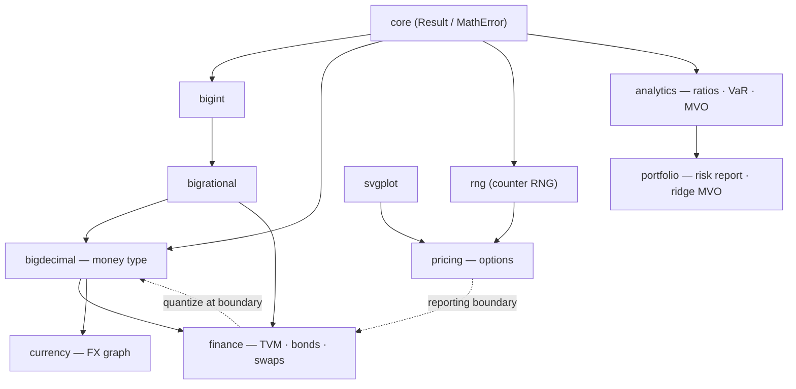
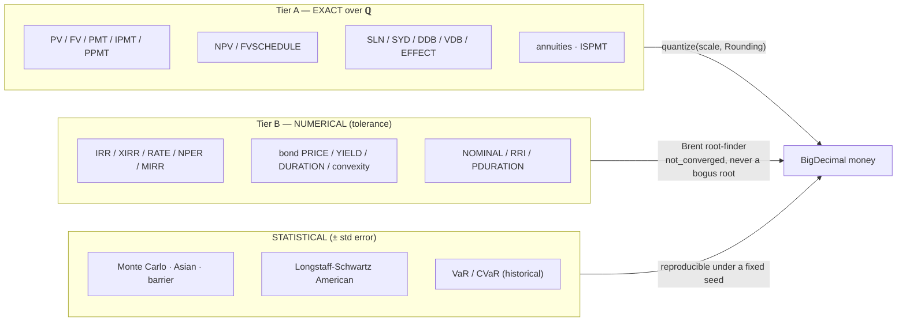
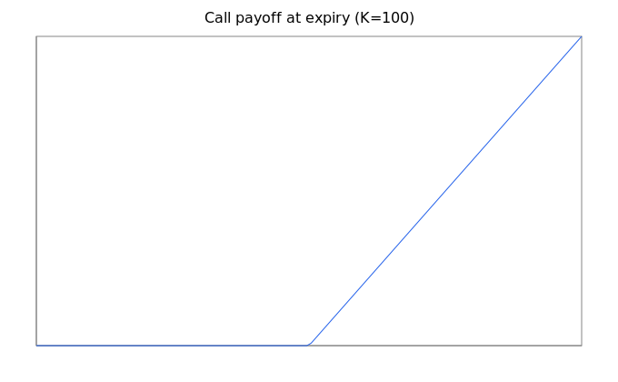
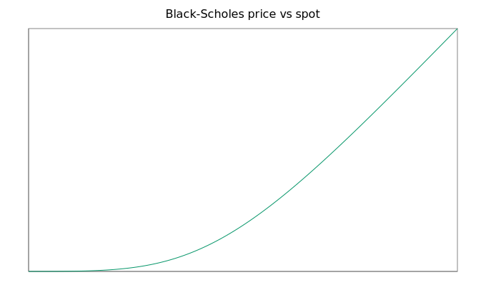
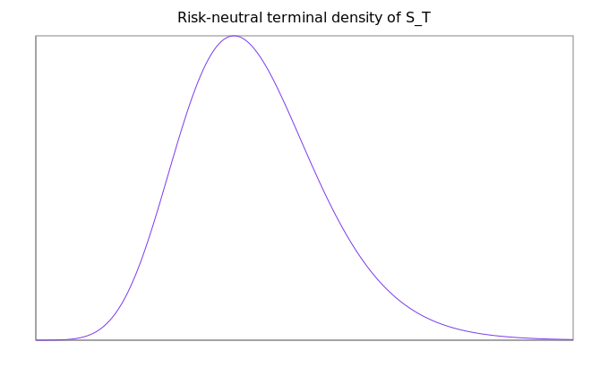
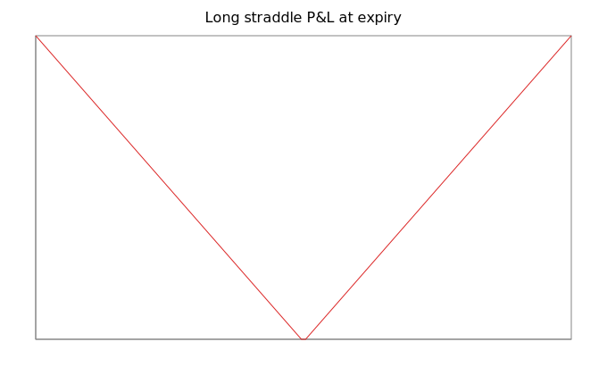
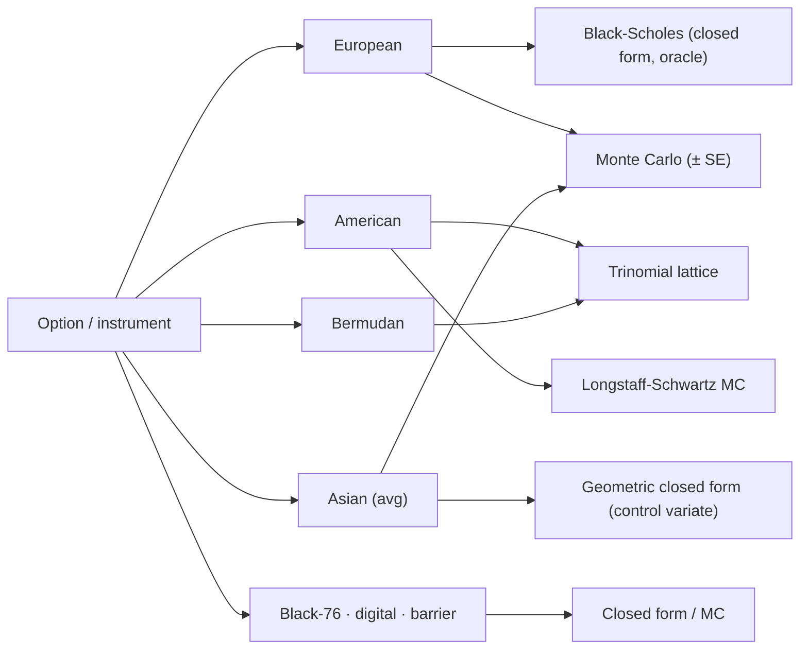
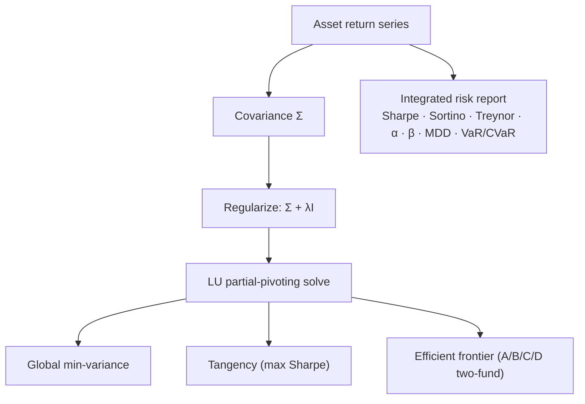

# Financial Mathematics — A Guide with Worked Examples

**Author:** Olumuyiwa Oluwasanmi

This guide is a hands-on tour of the NimbleCAS financial-mathematics stack —
[`bigdecimal`](../reference/bigdecimal.md), [`finance`](../reference/finance.md),
[`currency`](../reference/currency.md), [`pricing`](../reference/pricing.md),
[`analytics`](../reference/analytics.md), and [`portfolio`](../reference/portfolio.md) — with
copious runnable examples, engine-rendered charts, and architecture diagrams. Every chart in
this document was produced by the pricing engine itself (`nimblecas.svgplot`), not drawn by
hand. Every numeric example matches a passing test.

The design decisions behind the stack are recorded in
[`docs/technical/finance-parity-roadmap.md`](../technical/finance-parity-roadmap.md) (what is
implemented, the remaining backlog, and the documented convention divergences).

## Module map



## The two-tier honesty contract

The stack draws a sharp line between **money math** (exact, base-10, contractually rounded)
and **model math** (inherently numerical — an option price is a limit). Nothing dresses an
approximation as exact.



> **Excel-compat caveat (documented, never hidden):** Tier-A exact mode differs from Excel in
> trailing digits because Excel computes in IEEE double. The contract is "exact over ℚ — *more*
> accurate than Excel", never "exact" and "Excel-identical" in the same breath.

---

## 1. BigDecimal — money that behaves

Base-2 floats can't hold `0.1`; `BigRational` can't carry *scale* (`2.50` reduces to `5/2`).
`BigDecimal` is base-10 with an explicit scale and rounding mode.

```cpp
import nimblecas.bigdecimal;
using nimblecas::BigDecimal; using nimblecas::Rounding;

auto a = BigDecimal::from_string("0.1").value();
auto b = BigDecimal::from_string("0.2").value();
(a.add(b) == BigDecimal::from_string("0.3").value());          // true — exact, unlike double

// The classic 2.675 that binary rounds to 2.67:
BigDecimal::from_string("2.675").value()
    .quantize(2, Rounding::half_even).to_string();             // "2.68"

// Division REFUSES to guess when it can't terminate:
BigDecimal::from_string("1").value()
    .divide_exact(BigDecimal::from_string("3").value());        // error: inexact
BigDecimal::from_string("1").value()
    .divide(BigDecimal::from_string("3").value(), 4, Rounding::half_even)
    .value().to_string();                                       // "0.3333"
```

## 2. Finance — TVM, an amortization schedule, and a bond

```cpp
import nimblecas.finance;
using namespace nimblecas::finance;
using nimblecas::BigRational;
auto q = [](std::string_view s){ return BigRational::from_string(s).value(); };

// A $200,000 mortgage at 6%/yr (0.5%/month) over 360 months — exact over ℚ:
auto pay = pmt(q("1/200"), 360, q("200000"), q("0"));          // monthly payment
// Split any period into interest + principal, exactly:
auto i12 = ipmt(q("1/200"), 12, 360, q("200000"), q("0"));
auto p12 = ppmt(q("1/200"), 12, 360, q("200000"), q("0"));     // i12 + p12 == pay, exactly

// NPV at 100% of [100,100] == 100/2 + 100/4 == 75 (exact):
std::array<BigRational,2> cf{q("100"), q("100")};
npv(q("1"), cf).value();                                        // 75

// IRR is numerical (irrational root) — bracketed Brent, not a bogus root:
std::array<double,2> f{-100.0, 110.0};
irr(f).value();                                                 // 0.10

// A 5%-coupon 5-year bond, semiannual, priced to a 6% yield (numerical):
auto s = Date::of(2024,1,1).value(); auto m = Date::of(2029,1,1).value();
bond_price(s, m, 0.05, 0.06, 100.0, 2, DayCount::thirty_360);   // clean price
bond_convexity(s, m, 0.05, 0.06, 2, DayCount::thirty_360);      // second-order yield sensitivity
```

The honesty tier of every finance function is tabulated in the
[finance reference](../reference/finance.md#honesty-boundary--the-two-tier-contract).

## 3. Currency — an FX graph, cross rates, and arbitrage

The rate table is a directed graph; unquoted pairs are derived by shortest-path product, a
missing route is refused (never fabricated), and triangular arbitrage is checked exactly.

```cpp
import nimblecas.currency;
using namespace nimblecas::currency;
auto q = [](std::string_view s){ return nimblecas::BigRational::from_string(s).value(); };

auto fx = RateTable::create();
(void)fx.add("USD","EUR", q("9/10"));      // 1 USD -> 0.9 EUR (reciprocal auto-added)
(void)fx.add("EUR","GBP", q("8/10"));
fx.cross_rate("USD","GBP").value();        // 0.9*0.8 == 18/25, derived through the graph
fx.convert(Money::parse("100","USD").value(), "EUR", 2, nimblecas::Rounding::half_even);  // 90.00 EUR

// Covered-interest-parity forward: 100 * (1+0.02)/(1+0.05) == 680/7 (exact):
forward_rate(nimblecas::BigRational::from_int(100), q("1/20"), q("1/50"),
             nimblecas::BigRational::from_int(1)).value();      // 680/7
```

## 4. Pricing — Black-Scholes, the full Greek surface, trees, Monte Carlo, exotics

```cpp
import nimblecas.pricing;
using namespace nimblecas::pricing;

auto call = OptionSpec{}.with_spot(100).with_strike(100).with_rate(0.05)
                .with_volatility(0.2).with_expiry(1.0);
black_scholes_price(call).value();                  // 10.4506 (the textbook ATM 1y call)
auto g = black_scholes_greeks(call).value();        // delta 0.6368, gamma, vega, theta, rho
auto x = black_scholes_extended_greeks(call).value();  // vanna, charm, vomma, veta, speed,
                                                    // zomma, color, lambda, dual-delta/gamma,
                                                    // epsilon, vera, ultima
trinomial_price(call, 400, Exercise::american);     // American via a Kamrad-Ritchken lattice
auto mc = monte_carlo_european(call, 1'000'000, 42).value();   // price ± mc.std_error, reproducible
monte_carlo_asian(call, 50'000, 20, 7, true);       // arithmetic Asian, geometric control variate
longstaff_schwartz_american(call.with_type(OptionType::put), 40'000, 40, 7);  // LSM American
```

### Charts (engine-rendered)

The call's payoff, its Black-Scholes price curve, the risk-neutral density of the terminal
price, and a long-straddle P&L — all emitted by `nimblecas.svgplot`:

| Payoff at expiry | Price vs spot |
|---|---|
|  |  |

| Terminal risk-neutral density | Long-straddle P&L |
|---|---|
|  |  |

### The pricing-method taxonomy



## 5. Analytics & Portfolio — ratios, VaR, and the efficient frontier

```cpp
import nimblecas.analytics;
import nimblecas.portfolio;
using namespace nimblecas::portfolio;

// One-call risk scorecard over a return series and its benchmark:
std::array<double,3> r{-0.02, 0.01, 0.03}, mkt{-0.02, 0.01, 0.03};
auto rep = analyze(r, mkt, 0.0, 0.95).value();
// rep.sharpe, rep.sortino, rep.treynor, rep.jensen_alpha, rep.beta (==1),
// rep.max_drawdown (==0.02), rep.var_historical (==0.02), rep.var_parametric, ...

// Markowitz optimizer, ROBUST to a singular sample covariance via ridge (Σ + λI), LU-solved:
std::vector<std::vector<double>> cov{{0.04, 0.0}, {0.0, 0.09}};
min_variance_weights(cov, 0.0);                 // [0.6923, 0.3077]
tangency_weights(cov, std::array{0.10,0.12}, 0.02, 0.0);   // max-Sharpe weights
efficient_frontier(cov, std::array{0.08,0.12}, 20, 1e-6);  // 20 frontier points
```



## GPU acceleration & Python bindings

The whole finance stack is reachable from Python through the nanobind extension
`nimblecas_ext` — and the bindings **reuse the C++ engine**, computing nothing
themselves:

```python
import nimblecas_ext as n
n.pricing.black_scholes(100, 100, 0.05, 0.0, 0.2, 1.0, True)   # 10.4506
n.finance.irr([-100.0, 110.0])                                  # 0.10
n.analytics.min_variance_weights([[0.04, 0.0], [0.0, 0.09]])   # [0.6923, 0.3077]
price, se = n.pricing.monte_carlo(100, 100, 0.05, 0.0, 0.2, 1.0, True, 1_000_000, 42)
```

There is **one Monte-Carlo implementation**, not several: `pricing.monte_carlo`
forwards to the same `pricing::monte_carlo_european` (the reproducible counter-RNG
engine) that the [CUDA and Triton kernels](../reference/gpu.md) accelerate and
validate against the Black-Scholes oracle. On an RTX 5090 the Triton kernel prices
an 8M-path European call at 10.45238 ± 0.00260 — 0.69 standard errors from the
closed form. See the [Python bindings](../reference/python-bindings.md) and
[GPU](../reference/gpu.md) references.

## Where to go next

- Per-module reference: [bigdecimal](../reference/bigdecimal.md) ·
  [finance](../reference/finance.md) · [currency](../reference/currency.md) ·
  [pricing](../reference/pricing.md) · [analytics](../reference/analytics.md) ·
  [portfolio](../reference/portfolio.md).
- The full runnable showcase: `examples/finance_showcase.cpp`.
- Design + remaining parity backlog + convention divergences:
  [finance-parity-roadmap](../technical/finance-parity-roadmap.md).
```
